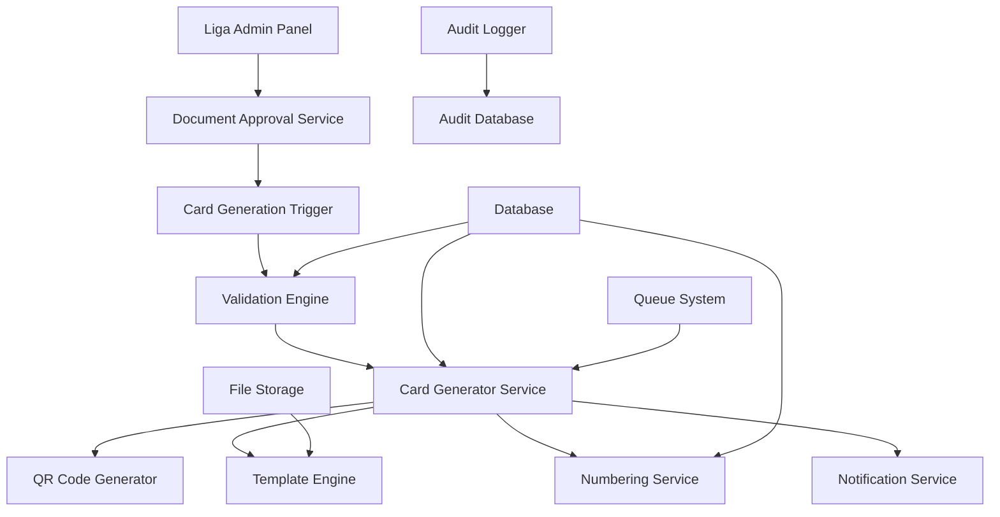

# Diseño del Sistema de Carnetización Automática

## Visión General

El Sistema de Carnetización Automática es un subsistema crítico de VolleyPass que automatiza completamente la generación de carnets digitales. El sistema se activa mediante eventos (triggers) y procesa la generación de carnets de manera asíncrona y confiable.

## Arquitectura del Sistema

### Componentes Principales



### Flujo de Datos

1. **Trigger de Aprobación**: Liga aprueba documentos → Evento disparado
2. **Validación**: Sistema valida datos y documentos
3. **Generación**: Creación del carnet con número único
4. **Almacenamiento**: Persistencia en base de datos y archivos
5. **Notificación**: Envío automático a stakeholders

## Componentes y Interfaces

### 1. Document Approval Service

**Responsabilidad**: Detectar aprobaciones de documentos y disparar el proceso de carnetización.

```php
interface DocumentApprovalServiceInterface
{
    public function approveDocuments(Player $player, User $approver): bool;
    public function triggerCardGeneration(Player $player): void;
    public function validateApprovalPermissions(User $approver, League $league): bool;
}
```

**Eventos Disparados**:
- `DocumentsApproved`: Cuando se aprueban documentos
- `CardGenerationTriggered`: Cuando se inicia generación de carnet

### 2. Card Generation Service

**Responsabilidad**: Orquestar todo el proceso de generación de carnets.

```php
interface CardGenerationServiceInterface
{
    public function generateCard(Player $player, League $league): PlayerCard;
    public function validatePreGeneration(Player $player): ValidationResult;
    public function processGeneration(Player $player, League $league): GenerationResult;
    public function handleGenerationFailure(Player $player, Exception $error): void;
}
```

**Estados del Proceso**:
- `PENDING`: Esperando generación
- `VALIDATING`: Validando datos
- `GENERATING`: Generando carnet
- `COMPLETED`: Generación exitosa
- `FAILED`: Error en generación

### 3. Validation Engine

**Responsabilidad**: Validar exhaustivamente todos los datos antes de la generación.

```php
interface ValidationEngineInterface
{
    public function validateDocuments(Player $player): DocumentValidationResult;
    public function validatePersonalData(Player $player): DataValidationResult;
    public function validateSportsData(Player $player): SportsValidationResult;
    public function validateSystemIntegrity(Player $player): IntegrityValidationResult;
}
```

**Validaciones Implementadas**:
- Documentos obligatorios presentes
- Formatos y tamaños de archivos
- Vigencia de certificaciones
- Consistencia de datos personales
- Categoría por edad automática
- Ausencia de duplicaciones
- Verificación de sanciones

### 4. Numbering Service

**Responsabilidad**: Generar números únicos para carnets.

```php
interface NumberingServiceInterface
{
    public function generateCardNumber(League $league): string;
    public function getNextSequential(League $league, int $year): int;
    public function validateUniqueness(string $cardNumber): bool;
    public function reserveNumber(string $cardNumber): bool;
}
```

**Algoritmo de Numeración**:
```
Formato: [CÓDIGO_LIGA]-[AÑO]-[SECUENCIAL]
Ejemplo: LVSUC-2025-000001

1. Obtener código de liga (máx 5 chars)
2. Obtener año actual
3. Consultar último secuencial para liga+año
4. Incrementar contador
5. Formatear con padding de ceros
6. Verificar unicidad
7. Reservar número si es único
```

### 5. QR Code Generator

**Responsabilidad**: Generar códigos QR seguros para verificación.

```php
interface QRCodeGeneratorInterface
{
    public function generateQRCode(PlayerCard $card): QRCodeResult;
    public function createVerificationToken(PlayerCard $card): string;
    public function generateQRImage(array $data): string;
}
```

**Contenido del QR**:
```json
{
    "card_id": "uuid-del-carnet",
    "card_number": "LVSUC-2025-000001",
    "verification_url": "https://api.volleypass.gov.co/verify/{token}",
    "generated_at": "2025-01-20T10:30:00Z",
    "expires_at": "2025-12-31T23:59:59Z"
}
```

### 6. Template Engine

**Responsabilidad**: Generar el diseño visual del carnet.

```php
interface TemplateEngineInterface
{
    public function renderCard(PlayerCard $card, League $league): string;
    public function getTemplate(League $league): CardTemplate;
    public function mergeData(CardTemplate $template, array $data): string;
    public function generatePDF(string $html): string;
}
```

**Elementos del Carnet**:
- Logo de la liga
- Fotografía de la jugadora
- Información personal (nombre, documento, categoría)
- Información deportiva (club, posición, número)
- Código QR de verificación
- Número del carnet
- Fechas de emisión y vencimiento
- Estado del carnet

### 7. Notification Service

**Responsabilidad**: Enviar notificaciones automáticas.

```php
interface NotificationServiceInterface
{
    public function notifyCardGenerated(PlayerCard $card): void;
    public function notifyPlayer(Player $player, PlayerCard $card): void;
    public function notifyClub(Club $club, PlayerCard $card): void;
    public function notifyLeague(League $league, PlayerCard $card): void;
    public function notifyError(Player $player, Exception $error): void;
}
```

**Canales de Notificación**:
- Email (principal)
- SMS (respaldo)
- Push notifications (app móvil)
- WhatsApp (integración API Business)

## Modelos de Datos

### PlayerCard Model

```php
class PlayerCard extends Model
{
    protected $fillable = [
        'player_id',
        'league_id',
        'card_number',
        'qr_code',
        'qr_token',
        'template_version',
        'status',
        'issued_at',
        'expires_at',
        'generated_by',
        'generation_metadata'
    ];

    protected $casts = [
        'issued_at' => 'datetime',
        'expires_at' => 'datetime',
        'generation_metadata' => 'array',
        'status' => CardStatus::class
    ];
}
```

### CardGenerationLog Model

```php
class CardGenerationLog extends Model
{
    protected $fillable = [
        'player_id',
        'league_id',
        'card_number',
        'status',
        'processing_time',
        'error_message',
        'metadata',
        'generated_by'
    ];

    protected $casts = [
        'processing_time' => 'integer', // milliseconds
        'metadata' => 'array'
    ];
}
```

### CardTemplate Model

```php
class CardTemplate extends Model
{
    protected $fillable = [
        'league_id',
        'name',
        'version',
        'html_template',
        'css_styles',
        'configuration',
        'is_active'
    ];

    protected $casts = [
        'configuration' => 'array',
        'is_active' => 'boolean'
    ];
}
```

## Manejo de Errores

### Estrategia de Reintentos

```php
class CardGenerationJob implements ShouldQueue
{
    public $tries = 3;
    public $backoff = [30, 60, 120]; // seconds
    
    public function handle()
    {
        try {
            $this->cardGenerationService->generateCard($this->player, $this->league);
        } catch (TemporaryException $e) {
            // Will be retried automatically
            throw $e;
        } catch (PermanentException $e) {
            // Log and notify for manual intervention
            $this->handlePermanentFailure($e);
        }
    }
}
```

### Tipos de Errores

1. **Errores Temporales** (reintentables):
   - Fallas de conexión a base de datos
   - Timeouts de servicios externos
   - Problemas temporales de almacenamiento

2. **Errores Permanentes** (requieren intervención):
   - Datos inválidos o corruptos
   - Documentos faltantes
   - Violaciones de reglas de negocio

### Rollback de Transacciones

```php
DB::transaction(function () use ($player, $league) {
    // 1. Reservar número de carnet
    $cardNumber = $this->numberingService->generateCardNumber($league);
    
    // 2. Crear registro de carnet
    $card = PlayerCard::create([...]);
    
    // 3. Generar QR y archivos
    $qrCode = $this->qrGenerator->generateQRCode($card);
    $cardFile = $this->templateEngine->renderCard($card, $league);
    
    // 4. Actualizar estado del jugador
    $player->update(['card_status' => CardStatus::ACTIVE]);
    
    // Si cualquier paso falla, todo se revierte automáticamente
});
```

## Seguridad

### Protección de Datos

1. **Cifrado en Tránsito**: HTTPS para todas las comunicaciones
2. **Cifrado en Reposo**: Base de datos y archivos cifrados
3. **Tokens Seguros**: JWT con expiración para verificación
4. **Control de Acceso**: Permisos basados en roles

### Validación de Autenticidad

```php
class CardVerificationController
{
    public function verify(string $token)
    {
        try {
            $payload = JWT::decode($token, $this->getPublicKey());
            
            $card = PlayerCard::where('qr_token', $token)
                ->where('expires_at', '>', now())
                ->where('status', CardStatus::ACTIVE)
                ->first();
                
            if (!$card) {
                return response()->json(['valid' => false]);
            }
            
            return response()->json([
                'valid' => true,
                'player_name' => $card->player->full_name,
                'card_number' => $card->card_number,
                'league' => $card->league->name,
                'status' => $card->status->value,
                'expires_at' => $card->expires_at->toISOString()
            ]);
            
        } catch (Exception $e) {
            return response()->json(['valid' => false]);
        }
    }
}
```

## Monitoreo y Métricas

### Métricas Clave

1. **Tiempo de Generación**: Promedio por carnet
2. **Tasa de Éxito**: Porcentaje de generaciones exitosas
3. **Errores por Tipo**: Clasificación de fallos
4. **Volumen Diario**: Carnets generados por día
5. **Tiempo de Respuesta**: API de verificación

### Alertas Automáticas

```php
class CardGenerationMonitor
{
    public function checkSystemHealth()
    {
        // Verificar fallos consecutivos
        $recentFailures = CardGenerationLog::where('status', 'failed')
            ->where('created_at', '>', now()->subMinutes(15))
            ->count();
            
        if ($recentFailures >= 3) {
            $this->alertService->sendAlert('Múltiples fallos en generación de carnets');
        }
        
        // Verificar tiempo de procesamiento
        $avgProcessingTime = CardGenerationLog::where('created_at', '>', now()->subHour())
            ->avg('processing_time');
            
        if ($avgProcessingTime > 300000) { // 5 minutes
            $this->alertService->sendAlert('Tiempo de generación excesivo');
        }
    }
}
```

## Configuración por Liga

### Parámetros Configurables

```php
class LeagueCardConfiguration extends Model
{
    protected $fillable = [
        'league_id',
        'card_validity_months',
        'required_documents',
        'template_id',
        'auto_renewal_enabled',
        'notification_settings'
    ];

    protected $casts = [
        'required_documents' => 'array',
        'auto_renewal_enabled' => 'boolean',
        'notification_settings' => 'array'
    ];
}
```

### Plantillas Personalizables

Cada liga puede tener:
- Logo y colores corporativos
- Layout personalizado
- Campos adicionales específicos
- Reglas de validación particulares
- Configuración de notificaciones

## Testing Strategy

### Pruebas Unitarias

- Validación de cada componente individualmente
- Mocking de dependencias externas
- Cobertura de casos edge

### Pruebas de Integración

- Flujo completo de generación
- Interacción entre componentes
- Manejo de errores y rollbacks

### Pruebas de Carga

- Generación simultánea de múltiples carnets
- Rendimiento bajo alta concurrencia
- Límites del sistema

### Pruebas de Seguridad

- Validación de tokens
- Prevención de ataques
- Protección de datos sensibles
