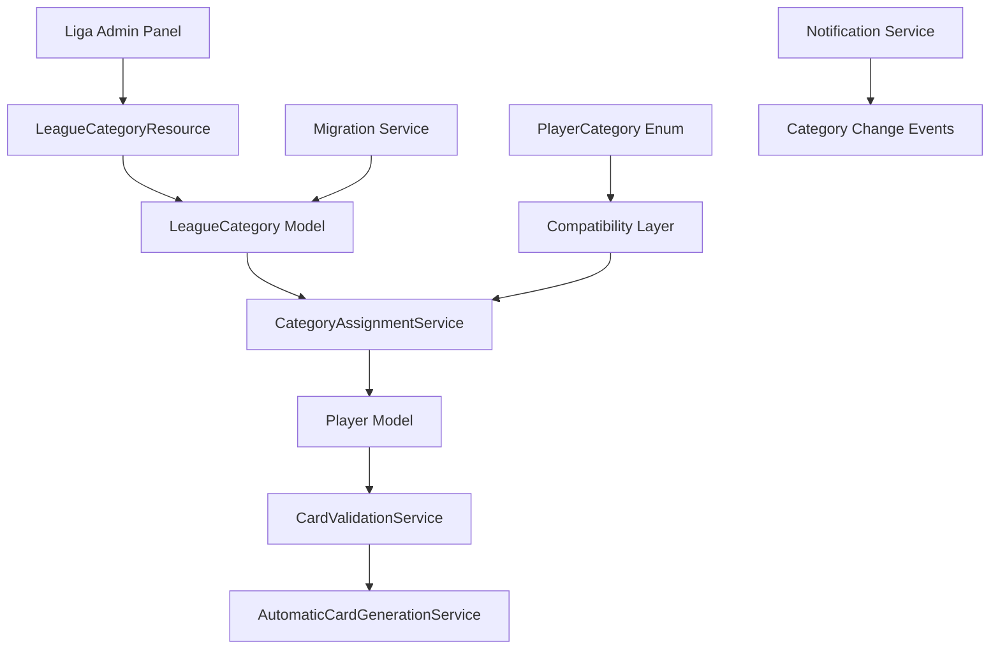

# Diseño del Sistema de Categorías Dinámicas por Liga

## Visión General

El Sistema de Categorías Dinámicas permite que cada liga configure sus propios rangos de edad y categorías deportivas, superando las limitaciones del sistema actual de categorías fijas. La arquitectura mantiene compatibilidad con el sistema existente mientras proporciona flexibilidad total para configuraciones específicas por liga.

## Arquitectura del Sistema

### Componentes Principales



### Flujo de Datos

1. **Configuración**: Liga configura categorías → `LeagueCategory` records
2. **Asignación**: Jugadora registrada → `CategoryAssignmentService` evalúa
3. **Validación**: Generación de carnet → `CardValidationService` verifica
4. **Notificación**: Cambios → `NotificationService` informa

## Modelos de Datos

### LeagueCategory Model

```php
class LeagueCategory extends Model
{
    protected $fillable = [
        'league_id',
        'category_key',
        'category_name', 
        'min_age',
        'max_age',
        'gender',
        'is_active',
        'display_order',
        'description',
        'special_rules'
    ];

    protected $casts = [
        'gender' => Gender::class,
        'is_active' => 'boolean',
        'min_age' => 'integer',
        'max_age' => 'integer',
        'display_order' => 'integer',
        'special_rules' => 'array'
    ];

    // Relaciones
    public function league(): BelongsTo;
    public function players(): HasMany;
    
    // Métodos de negocio
    public function isAgeEligible(int $age): bool;
    public function getAgeRangeText(): string;
    public function hasSpecialRules(): bool;
}
```

### Extensión del League Model

```php
class League extends Model
{
    // Nueva relación
    public function categories(): HasMany
    {
        return $this->hasMany(LeagueCategory::class)
            ->where('is_active', true)
            ->orderBy('display_order');
    }

    // Métodos de categorías
    public function getCategoryForAge(int $age, Gender $gender): ?LeagueCategory;
    public function getAvailableCategories(Gender $gender = null): Collection;
    public function hasCustomCategories(): bool;
    public function validateCategoryConfiguration(): array;
}
```

### Migración de Base de Datos

```sql
CREATE TABLE league_categories (
    id BIGINT UNSIGNED AUTO_INCREMENT PRIMARY KEY,
    league_id BIGINT UNSIGNED NOT NULL,
    category_key VARCHAR(50) NOT NULL,
    category_name VARCHAR(100) NOT NULL,
    min_age INTEGER NOT NULL,
    max_age INTEGER NOT NULL,
    gender ENUM('female', 'male', 'mixed') NOT NULL,
    is_active BOOLEAN DEFAULT TRUE,
    display_order INTEGER DEFAULT 0,
    description TEXT NULL,
    special_rules JSON NULL,
    created_at TIMESTAMP NULL,
    updated_at TIMESTAMP NULL,
    
    FOREIGN KEY (league_id) REFERENCES leagues(id) ON DELETE CASCADE,
    UNIQUE KEY unique_league_category (league_id, category_key, gender),
    INDEX idx_league_active (league_id, is_active),
    INDEX idx_age_range (min_age, max_age),
    INDEX idx_gender_category (gender, category_key)
);
```

## Servicios Principales

### CategoryAssignmentService

**Responsabilidad**: Asignar automáticamente categorías basándose en configuración dinámica.

```php
interface CategoryAssignmentServiceInterface
{
    public function assignAutomaticCategory(Player $player): ?string;
    public function validateCategoryChange(Player $player, string $newCategory): ValidationResult;
    public function reassignPlayersForLeague(League $league): array;
    public function getEligibleCategories(User $user, League $league): Collection;
}
```

**Algoritmo de Asignación**:
1. Obtener edad y género de la jugadora
2. Consultar configuración de categorías de la liga
3. Buscar categoría que coincida con edad y género
4. Aplicar reglas especiales si existen
5. Fallback al enum tradicional si no hay configuración
6. Registrar asignación para auditoría

### LeagueConfigurationService (Extensión)

**Responsabilidad**: Gestionar configuraciones de categorías por liga.

```php
interface LeagueConfigurationServiceInterface
{
    public function createDefaultCategories(League $league): array;
    public function validateCategoryConfiguration(League $league): ValidationResult;
    public function migrateExistingPlayers(League $league): MigrationResult;
    public function exportCategoryConfiguration(League $league): array;
    public function importCategoryConfiguration(League $league, array $config): ImportResult;
}
```

### CategoryValidationService

**Responsabilidad**: Validar configuraciones y asignaciones de categorías.

```php
interface CategoryValidationServiceInterface
{
    public function validateAgeRanges(array $categories): ValidationResult;
    public function checkOverlappingRanges(array $categories, Gender $gender): array;
    public function validateSpecialRules(array $rules): ValidationResult;
    public function validatePlayerEligibility(Player $player, string $category): ValidationResult;
}
```

## Interface de Usuario

### LeagueCategoryResource (Filament)

**Características**:
- CRUD completo para categorías por liga
- Validaciones en tiempo real
- Preview de impacto en jugadoras existentes
- Importación/exportación de configuraciones
- Estadísticas por categoría

```php
class LeagueCategoryResource extends Resource
{
    protected static ?string $model = LeagueCategory::class;
    protected static ?string $navigationLabel = 'Categorías';
    protected static ?string $navigationGroup = 'Configuración Liga';

    public static function form(Form $form): Form
    {
        return $form->schema([
            // Configuración básica
            Forms\Components\Select::make('league_id')
                ->relationship('league', 'name')
                ->required()
                ->reactive(),
                
            Forms\Components\TextInput::make('category_name')
                ->required()
                ->live(onBlur: true)
                ->afterStateUpdated(fn ($state, callable $set) => 
                    $set('category_key', Str::slug($state))),
                    
            // Configuración de edad
            Forms\Components\Grid::make(2)->schema([
                Forms\Components\TextInput::make('min_age')
                    ->numeric()
                    ->minValue(5)
                    ->maxValue(100)
                    ->required()
                    ->live(),
                    
                Forms\Components\TextInput::make('max_age')
                    ->numeric()
                    ->minValue(5)
                    ->maxValue(100)
                    ->required()
                    ->live()
                    ->afterStateUpdated(function ($state, $get, $set) {
                        if ($state <= $get('min_age')) {
                            $set('max_age', $get('min_age') + 1);
                        }
                    }),
            ]),
            
            // Configuración avanzada
            Forms\Components\Select::make('gender')
                ->options(Gender::class)
                ->required(),
                
            Forms\Components\KeyValue::make('special_rules')
                ->label('Reglas Especiales')
                ->keyLabel('Regla')
                ->valueLabel('Valor'),
        ]);
    }
}
```

### Extensión del LeagueResource

```php
// Agregar tab de categorías en LeagueResource
Infolists\Components\Tabs\Tab::make('Categorías')
    ->icon('heroicon-o-user-group')
    ->schema([
        Infolists\Components\Section::make('Configuración de Categorías')
            ->schema([
                Infolists\Components\Actions::make([
                    Infolists\Components\Actions\Action::make('create_default')
                        ->label('Crear Categorías por Defecto')
                        ->action(fn ($record) => 
                            app(LeagueConfigurationService::class)
                                ->createDefaultCategories($record)),
                                
                    Infolists\Components\Actions\Action::make('validate_config')
                        ->label('Validar Configuración')
                        ->action(fn ($record) => 
                            app(CategoryValidationService::class)
                                ->validateCategoryConfiguration($record)),
                ]),
                
                Infolists\Components\RepeatableEntry::make('categories')
                    ->schema([
                        Infolists\Components\TextEntry::make('category_name'),
                        Infolists\Components\TextEntry::make('age_range')
                            ->getStateUsing(fn ($record) => 
                                "{$record->min_age}-{$record->max_age} años"),
                        Infolists\Components\TextEntry::make('gender')->badge(),
                        Infolists\Components\TextEntry::make('players_count')
                            ->counts('players'),
                    ])->columns(4)
            ])
    ])
```

## Migración y Compatibilidad

### Estrategia de Migración

1. **Fase 1: Preparación**
   - Crear tabla `league_categories`
   - Agregar índices optimizados
   - Preparar servicios de migración

2. **Fase 2: Migración de Datos**
   - Para cada liga existente, crear configuración por defecto
   - Usar rangos actuales del enum como base
   - Validar que todas las jugadoras mantengan categorías válidas

3. **Fase 3: Activación**
   - Activar servicios de asignación dinámica
   - Mantener enum como fallback
   - Monitorear inconsistencias

### Compatibilidad con Código Existente

```php
// Extensión del PlayerCategory enum para compatibilidad
enum PlayerCategory: string implements HasLabel, HasColor, HasIcon
{
    // Valores existentes...
    
    // Nuevo método para asignación dinámica
    public static function getForAge(int $age, Gender $gender, ?League $league = null): self
    {
        if ($league && $league->hasCustomCategories()) {
            $category = $league->getCategoryForAge($age, $gender);
            if ($category) {
                return self::from($category->category_key);
            }
        }
        
        // Fallback a lógica tradicional
        return match (true) {
            $age >= 8 && $age <= 10 => self::Mini,
            $age >= 11 && $age <= 12 => self::Pre_Mini,
            // ... resto de lógica
            default => self::Mayores,
        };
    }
    
    // Método para obtener rango dinámico
    public function getAgeRange(?League $league = null): array
    {
        if ($league && $league->hasCustomCategories()) {
            $category = $league->categories()
                ->where('category_key', $this->value)
                ->first();
            if ($category) {
                return [$category->min_age, $category->max_age];
            }
        }
        
        // Fallback a rangos fijos
        return $this->getDefaultAgeRange();
    }
}
```

## Validaciones y Reglas de Negocio

### Validaciones de Configuración

1. **Rangos de Edad**:
   - `min_age` < `max_age`
   - No superposición entre categorías del mismo género
   - Cobertura completa de rangos necesarios

2. **Consistencia de Datos**:
   - Nombres únicos por liga
   - Claves de categoría válidas
   - Géneros consistentes

3. **Impacto en Jugadoras**:
   - Validar reasignaciones necesarias
   - Alertar sobre jugadoras que quedarían sin categoría
   - Confirmar cambios masivos

### Reglas Especiales

```php
// Ejemplo de reglas especiales
$specialRules = [
    'requires_medical_clearance' => true,
    'max_players_per_team' => 12,
    'allows_guest_players' => false,
    'tournament_eligibility' => ['regional', 'national'],
    'minimum_experience_months' => 6
];
```

## Performance y Optimización

### Estrategias de Cache

```php
class CategoryCacheService
{
    public function getCategoriesForLeague(League $league): Collection
    {
        return Cache::remember(
            "league_categories_{$league->id}",
            now()->addHours(24),
            fn () => $league->categories()->get()
        );
    }
    
    public function invalidateLeagueCache(League $league): void
    {
        Cache::forget("league_categories_{$league->id}");
        Cache::forget("category_assignments_{$league->id}");
    }
}
```

### Índices de Base de Datos

```sql
-- Optimización para consultas frecuentes
CREATE INDEX idx_league_categories_lookup 
ON league_categories (league_id, gender, is_active, min_age, max_age);

CREATE INDEX idx_players_category_assignment 
ON players (current_club_id, category);

CREATE INDEX idx_age_based_queries 
ON users (birth_date, gender);
```

## Monitoreo y Auditoría

### Eventos de Auditoría

```php
// Eventos para tracking de cambios
class CategoryConfigurationChanged extends Event
{
    public function __construct(
        public League $league,
        public array $oldConfiguration,
        public array $newConfiguration,
        public User $changedBy
    ) {}
}

class PlayerCategoryReassigned extends Event
{
    public function __construct(
        public Player $player,
        public string $oldCategory,
        public string $newCategory,
        public string $reason
    ) {}
}
```

### Métricas de Sistema

- Tiempo de asignación de categorías
- Número de reasignaciones por cambio de configuración
- Distribución de jugadoras por categoría y liga
- Errores de validación por tipo

## Testing Strategy

### Pruebas Unitarias

```php
class CategoryAssignmentServiceTest extends TestCase
{
    public function test_assigns_correct_category_based_on_league_configuration()
    {
        // Arrange
        $league = League::factory()->create();
        $category = LeagueCategory::factory()->create([
            'league_id' => $league->id,
            'min_age' => 15,
            'max_age' => 17,
            'gender' => Gender::Female
        ]);
        
        $player = Player::factory()->create();
        $player->user->update(['birth_date' => now()->subYears(16)]);
        
        // Act
        $result = app(CategoryAssignmentService::class)
            ->assignAutomaticCategory($player);
        
        // Assert
        $this->assertEquals($category->category_key, $result);
    }
}
```

### Pruebas de Integración

- Migración completa de datos existentes
- Validación de configuraciones complejas
- Performance con múltiples ligas
- Compatibilidad con código existente

## Seguridad

### Control de Acceso

- Solo administradores de liga pueden modificar categorías
- Validación de permisos por liga específica
- Auditoría de todos los cambios de configuración
- Prevención de modificaciones no autorizadas

### Validación de Datos

- Sanitización de inputs de configuración
- Validación de rangos lógicos
- Prevención de inyección en reglas especiales
- Verificación de integridad de datos migrados
