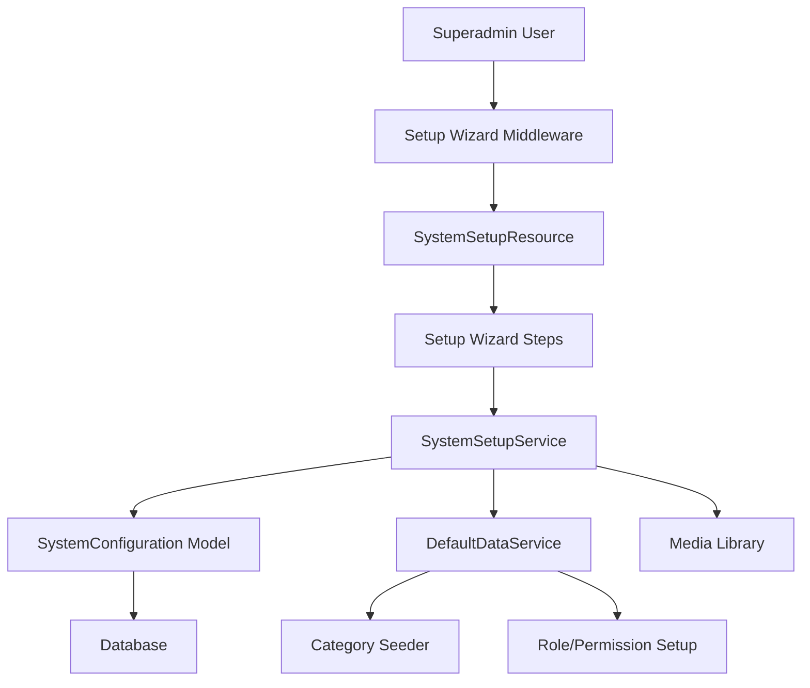

# Design Document

## Overview

The Sistema de Setup Superadmin is designed as a comprehensive initialization wizard that ensures VolleyPass is properly configured before any operational use. The system leverages the existing SystemConfiguration model and service architecture while introducing a new wizard-based interface using Filament's form components. The design emphasizes user experience through a step-by-step guided process with real-time validation, auto-save functionality, and comprehensive preview capabilities.

The system integrates seamlessly with the existing Filament admin panel architecture and extends the current SystemConfigurationService to handle wizard-specific operations. It introduces new middleware to enforce setup completion and provides a robust foundation for the subsequent league onboarding system.

## Architecture

### High-Level Architecture



### Component Architecture

The system follows a layered architecture pattern:

1. **Presentation Layer**: Filament Resources and Custom Components
2. **Service Layer**: Business logic and orchestration services
3. **Data Layer**: Models and database interactions
4. **Infrastructure Layer**: Middleware, validation, and external integrations

### Integration Points

- **Existing SystemConfiguration**: Extends current configuration management
- **Filament Admin Panel**: Integrates as a specialized resource
- **Media Library**: Handles logo and asset uploads
- **Spatie Permissions**: Manages access control
- **Activity Log**: Tracks all configuration changes

## Components and Interfaces

### Core Components

#### 1. SystemSetupResource (Filament Resource)

```php
class SystemSetupResource extends Resource
{
    // Wizard-based form with 7 steps
    // Custom navigation and progress tracking
    // Step validation and auto-save
    // Preview functionality
}
```

**Key Features:**
- Multi-step wizard interface
- Progress indicator with step validation
- Real-time preview of configuration changes
- Auto-save functionality between steps
- Comprehensive validation per step

#### 2. SystemSetupService

```php
class SystemSetupService
{
    public function initializeSetup(): SetupState
    public function updateStep(string $step, array $data): bool
    public function validateStep(string $step, array $data): ValidationResult
    public function completeSetup(): bool
    public function getSetupProgress(): array
    public function resetSetup(): bool
}
```

**Responsibilities:**
- Orchestrate the setup process
- Manage step transitions and validation
- Handle configuration persistence
- Coordinate with other services

#### 3. DefaultDataService

```php
class DefaultDataService
{
    public function seedDefaultCategories(): void
    public function createSystemRoles(): void
    public function setupDefaultPermissions(): void
    public function createInitialSettings(): void
}
```

**Responsibilities:**
- Populate default volleyball categories
- Create necessary system roles
- Set up permission structure
- Initialize system settings

#### 4. SetupValidationService

```php
class SetupValidationService
{
    public function validateBasicInfo(array $data): ValidationResult
    public function validateContactInfo(array $data): ValidationResult
    public function validateRegionalConfig(array $data): ValidationResult
    public function validateVolleyballRules(array $data): ValidationResult
    public function validateCategories(array $data): ValidationResult
}
```

**Responsibilities:**
- Provide step-specific validation
- Cross-validate related configurations
- Ensure data consistency
- Generate user-friendly error messages

### Custom Filament Components

#### 1. SetupWizardStep Component

```php
class SetupWizardStep extends Component
{
    public string $title
    public string $description
    public int $stepNumber
    public bool $isCompleted
    public bool $isActive
    
    public function render(): View
}
```

#### 2. ColorPickerField Component

```php
class ColorPickerField extends Field
{
    public function withPreview(): static
    public function withPalette(array $colors): static
}
```

#### 3. LogoUploaderField Component

```php
class LogoUploaderField extends Field
{
    public function withPreview(): static
    public function withDimensions(int $width, int $height): static
    public function withFormats(array $formats): static
}
```

#### 4. ConfigurationPreview Component

```php
class ConfigurationPreview extends Component
{
    public array $configuration
    
    public function render(): View
}
```

### Middleware Components

#### 1. RequireSystemSetupMiddleware

```php
class RequireSystemSetupMiddleware
{
    public function handle(Request $request, Closure $next): Response
    {
        // Check if setup is completed
        // Redirect to setup wizard if not
        // Allow access to setup routes and logout
    }
}
```

#### 2. SetupAccessMiddleware

```php
class SetupAccessMiddleware
{
    public function handle(Request $request, Closure $next): Response
    {
        // Ensure only superadmin can access setup
        // Prevent access if setup is already completed
        // Handle setup state transitions
    }
}
```

## Data Models

### Extended SystemConfiguration Model

The existing SystemConfiguration model will be extended to support setup-specific functionality:

```php
// New methods added to existing model
class SystemConfiguration extends Model
{
    public static function isSetupCompleted(): bool
    public static function getSetupProgress(): array
    public static function markSetupCompleted(): void
    public static function getSetupConfiguration(): array
}
```

### New SetupState Model

```php
class SetupState extends Model
{
    protected $fillable = [
        'current_step',
        'completed_steps',
        'configuration_data',
        'started_at',
        'completed_at',
        'created_by'
    ];
    
    protected $casts = [
        'completed_steps' => 'array',
        'configuration_data' => 'array',
        'started_at' => 'datetime',
        'completed_at' => 'datetime'
    ];
}
```

### Category Model Extension

```php
// New seeder data structure
class DefaultCategoriesSeeder extends Seeder
{
    protected array $defaultCategories = [
        [
            'name' => 'Pre-Infantil',
            'min_age' => 8,
            'max_age' => 10,
            'gender' => 'mixed',
            'special_rules' => ['shorter_sets' => true, 'modified_net_height' => true]
        ],
        // ... additional categories
    ];
}
```

## Error Handling

### Validation Strategy

1. **Client-Side Validation**: Real-time validation using Filament's built-in validation
2. **Server-Side Validation**: Comprehensive validation in service layer
3. **Cross-Step Validation**: Ensure consistency across wizard steps
4. **Business Rule Validation**: Volleyball-specific rule validation

### Error Recovery

1. **Auto-Save Recovery**: Automatic recovery of unsaved data
2. **Step Rollback**: Ability to return to previous steps
3. **Configuration Backup**: Backup before critical changes
4. **Graceful Degradation**: System remains functional during setup issues

### Error Reporting

```php
class SetupErrorHandler
{
    public function handleValidationError(ValidationException $e): Response
    public function handleServiceError(ServiceException $e): Response
    public function logSetupError(Exception $e, array $context): void
}
```

## Testing Strategy

### Unit Testing

1. **Service Layer Tests**: Test all business logic in services
2. **Model Tests**: Test model methods and relationships
3. **Validation Tests**: Test all validation rules and edge cases
4. **Component Tests**: Test custom Filament components

### Integration Testing

1. **Wizard Flow Tests**: Test complete setup flow
2. **Middleware Tests**: Test access control and redirects
3. **Database Tests**: Test data persistence and consistency
4. **File Upload Tests**: Test logo and media handling

### Feature Testing

1. **End-to-End Setup**: Complete setup process testing
2. **User Experience Tests**: Test wizard usability
3. **Permission Tests**: Test access control scenarios
4. **Recovery Tests**: Test error recovery scenarios

### Test Structure

```php
// tests/Feature/SystemSetup/
- SetupWizardFlowTest.php
- SetupValidationTest.php
- SetupMiddlewareTest.php
- DefaultDataSeedingTest.php

// tests/Unit/Services/
- SystemSetupServiceTest.php
- DefaultDataServiceTest.php
- SetupValidationServiceTest.php

// tests/Unit/Components/
- SetupWizardStepTest.php
- ColorPickerFieldTest.php
- LogoUploaderFieldTest.php
```

## Security Considerations

### Access Control

1. **Superadmin Only**: Setup wizard accessible only to superadmin users
2. **One-Time Setup**: Prevent multiple setup executions
3. **Session Security**: Secure session handling during setup
4. **CSRF Protection**: Protect against cross-site request forgery

### Data Protection

1. **Input Sanitization**: Sanitize all user inputs
2. **File Upload Security**: Secure file upload handling
3. **Configuration Encryption**: Encrypt sensitive configuration data
4. **Audit Logging**: Log all setup activities

### Validation Security

1. **Server-Side Validation**: Never trust client-side validation alone
2. **Business Rule Enforcement**: Enforce volleyball-specific rules
3. **Data Consistency**: Ensure configuration consistency
4. **Rate Limiting**: Prevent abuse of setup endpoints

## Performance Considerations

### Optimization Strategies

1. **Lazy Loading**: Load wizard steps on demand
2. **Caching**: Cache configuration data and validation results
3. **Asset Optimization**: Optimize uploaded images and assets
4. **Database Optimization**: Efficient queries and indexing

### Scalability

1. **Service Architecture**: Scalable service-oriented design
2. **Queue Processing**: Background processing for heavy operations
3. **Resource Management**: Efficient memory and CPU usage
4. **Database Design**: Optimized database schema

### Monitoring

1. **Performance Metrics**: Track setup completion times
2. **Error Monitoring**: Monitor and alert on setup errors
3. **Usage Analytics**: Track setup wizard usage patterns
4. **Resource Monitoring**: Monitor system resource usage

## Implementation Phases

### Phase 1: Core Infrastructure (Days 1-2)

1. Create SetupState model and migration
2. Implement SystemSetupService
3. Create setup middleware components
4. Set up basic wizard structure

### Phase 2: Wizard Implementation (Days 3-5)

1. Implement SystemSetupResource
2. Create wizard steps and validation
3. Implement custom Filament components
4. Add auto-save functionality

### Phase 3: Data and Services (Days 6-7)

1. Implement DefaultDataService
2. Create category seeding system
3. Implement configuration preview
4. Add error handling and recovery

### Phase 4: Testing and Polish (Days 8-9)

1. Comprehensive testing suite
2. User experience refinements
3. Performance optimization
4. Documentation and deployment

## Dependencies and Integration

### External Dependencies

1. **Filament**: Admin panel framework
2. **Spatie Media Library**: File and image handling
3. **Spatie Permission**: Role and permission management
4. **Spatie Activity Log**: Audit logging

### Internal Dependencies

1. **SystemConfiguration Model**: Core configuration management
2. **SystemConfigurationService**: Configuration service layer
3. **User Model**: Authentication and authorization
4. **Existing Middleware**: Integration with current middleware stack

### Integration Points

1. **Filament Navigation**: Integrate with admin panel navigation
2. **Permission System**: Integrate with existing permissions
3. **Configuration System**: Extend current configuration management
4. **Audit System**: Integrate with activity logging
