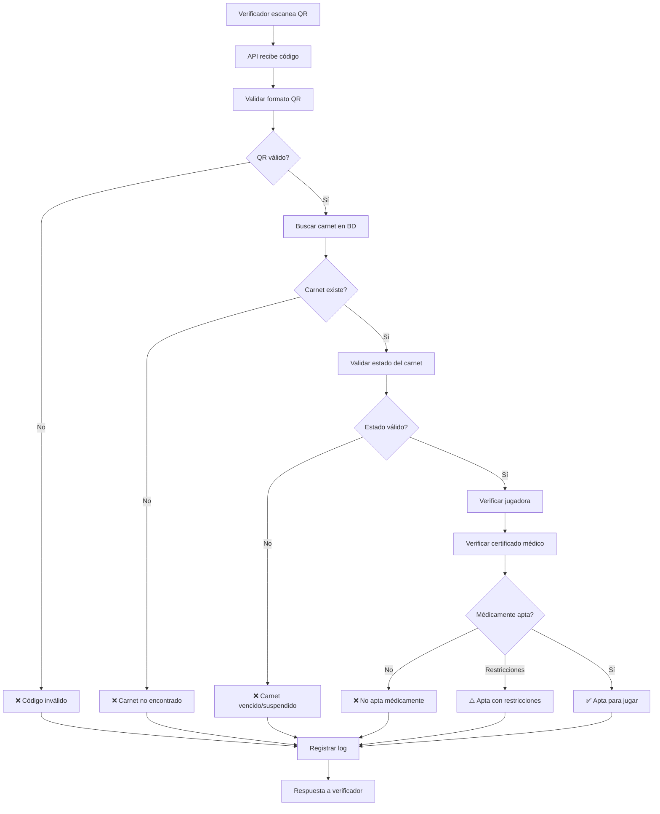
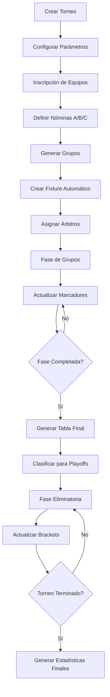

# 🏐 VolleyPass Sucre

<div align="center">


**Plataforma Integral de Gestión para Ligas de Voleibol**  
*Sistema de Digitalización y Carnetización Deportiva*

[](https://laravel.com)
[](https://filamentphp.com)
[](https://livewire.laravel.com)
[](https://php.net)

[🚀 Demo En Vivo](#) • [📖 Documentación](#) • [🐛 Reportar Bug](#) • [💡 Solicitar Feature](#)

</div>

---

## 📖 Tabla de Contenidos

- [📖 Acerca del Proyecto](#-acerca-del-proyecto)
- [🎯 Objetivos](#-objetivos)
- [✨ Características](#-características)
- [📊 Estado del Proyecto](#-estado-del-proyecto)
- [🏗️ Arquitectura](#-arquitectura)
- [🛠️ Tecnologías](#-tecnologías)
- [⚙️ Instalación](#-instalación)
- [🚀 Inicio Rápido](#-inicio-rápido)
- [🌐 Componentes Frontend](#-componentes-frontend)
- [🔧 Comandos Especializados](#-comandos-especializados)
- [🛡️ Seguridad y Performance](#-seguridad-y-performance)
- [🧪 Testing](#-testing)
- [🤝 Contribuir](#-contribuir)
- [📞 Soporte](#-soporte)
- [📄 Licencia](#-licencia)

---

## 📖 Acerca del Proyecto

**VolleyPass Sucre** es una plataforma integral diseñada para digitalizar y modernizar la gestión de la Liga de Voleibol de Sucre, Colombia. El sistema centraliza el registro, verificación y gestión de jugadoras, entrenadores y clubes, tanto **federados** (oficiales) como **descentralizados** (ligas alternas), garantizando transparencia, eficiencia y control en torneos oficiales y no oficiales.

### 🎯 Objetivos

Crear un ecosistema digital completo que permita:

- ✅ **Gestión dual**: Equipos federados (liga oficial) y descentralizados (ligas alternas)
- ✅ **Sistema de federación**: Control de pagos, consignaciones y membresías
- ✅ **Reglas configurables**: Cada liga define sus propias normativas
- ✅ **Control de traspasos**: Autorización obligatoria por parte de la liga
- ✅ **Verificación instantánea** en partidos mediante códigos QR
- ✅ **Gestión completa de torneos** oficiales y alternos
- ✅ **Transparencia financiera** y deportiva

### 👥 Público Objetivo

- **Jugadoras y entrenadores** federados y de ligas alternas
- **Directivos de clubes** oficiales y descentralizados
- **Administradores de ligas** departamentales y alternativas
- **Organizadores de torneos** oficiales y no oficiales
- **Árbitros y cuerpo técnico** en eventos deportivos
- **Espectadores** con acceso a marcadores en tiempo real
- **Federaciones deportivas** y entidades reguladoras

---

## 📊 Estado del Proyecto

### 🎯 **PROGRESO GENERAL: 95% COMPLETADO**

| Fase | Estado | Progreso | Detalles |
|------|--------|----------|----------|
| **🏗️ Infraestructura Base** | ✅ Completada | 100% | Laravel 11.x + Filament 3.x + 8 paquetes Spatie |
| **🆔 Carnetización Digital** | ✅ Completada | 100% | Sistema QR + API verificación + notificaciones |
| **⚖️ Gestión Avanzada** | ✅ Completada | 85% | Configuraciones + federación + traspasos |
| **🏆 Sistema de Torneos** | ✅ Completada | 90% | TournamentResource + algoritmos + cache |
| **💻 Interfaces Admin** | ✅ Completada | 95% | 13+ Resources Filament operativos |
| **🌐 Componentes Frontend** | 🚧 En Desarrollo | 5% | Welcome + dashboards públicos |

### ✅ **Módulos Completamente Funcionales**

<details>
<summary><strong>🔐 Sistema de Usuarios Multi-Rol</strong></summary>

- **SuperAdmin**: Acceso total al sistema
- **LeagueAdmin**: Administrador de liga departamental  
- **ClubDirector**: Director de club deportivo
- **Player**: Jugadora registrada
- **Coach**: Entrenador certificado
- **SportsDoctor**: Médico deportivo
- **Verifier**: Verificador de carnets en partidos
- **Referee**: Árbitro certificado para partidos oficiales

**Sistema de Contraseñas Temporales:**
- Generación automática al crear usuario
- Login forzoso para cambio en primer acceso
- Notificación por email con credenciales
- Expiración de contraseña temporal (7 días)

</details>

<details>
<summary><strong>🏛️ Jerarquía Organizacional</strong></summary>

```
Liga (Departamental)
└── Clubes
    ├── Jugadoras
    ├── Entrenadores  
    └── Equipos por Categoría
        ├── Mini (8-10 años)
        ├── Pre-Mini (11-12 años)
        ├── Infantil (13-14 años)
        ├── Cadete (15-16 años)
        ├── Juvenil (17-18 años)
        ├── Mayores (19+ años)
        └── Masters (35+ años)
```

**Gestión Dual de Equipos:**
- **Federados**: Control estricto, pagos validados, traspasos autorizados
- **Descentralizados**: Gestión flexible, reglas propias, autonomía administrativa

</details>

<details>
<summary><strong>🆔 Sistema de Carnetización Digital</strong></summary>

- **Generación automática** tras aprobación de documentos
- **QR únicos** con hash SHA-256 y tokens de verificación
- **Estados avanzados**: Activo, vencido, suspendido, restricción médica
- **Renovación automática** por temporadas
- **API de verificación** en tiempo real
- **Historial completo** de cambios y verificaciones

</details>

<details>
<summary><strong>🏆 Sistema Completo de Torneos</strong></summary>

**Tipos de Torneo:**
- **Liga Regular**: Todos contra todos
- **Copa/Eliminación**: Fase eliminatoria directa
- **Mixto**: Fase de grupos + eliminatorias
- **Torneo Relámpago**: Formato corto intensivo

**Funcionalidades Avanzadas:**
- **TournamentResource** completo en Filament
- **Algoritmos de distribución** de grupos balanceados
- **Sistema de puntuación** configurable
- **Gestión de amonestaciones** con tarjetas
- **Cache inteligente** para performance óptima

</details>

<details>
<summary><strong>⚖️ Sistema de Configuraciones por Liga</strong></summary>

**30+ Configuraciones organizadas en 6 grupos:**
- 🔄 **Traspasos** (6 configs): Reglas de transferencias
- 📄 **Documentación** (6 configs): Requisitos documentales
- 👥 **Categorías** (4 configs): Reglas por edad  
- ⚖️ **Disciplina** (4 configs): Sanciones y apelaciones
- 🛡️ **Federación** (4 configs): Control federativo
- 📺 **Vista Pública** (5 configs): Configuraciones de privacidad

**Comandos disponibles:**
```bash
php artisan league:config get 1 transfer_approval_required
php artisan league:config set 1 max_transfers_per_season 3
php artisan league:config list 1 --group=transfers
```

</details>

<details>
<summary><strong>💻 Panel Administrativo Completo</strong></summary>

**13+ Resources Filament Implementados:**
- ✅ **PlayerResource** - Gestión completa de jugadoras
- ✅ **ClubResource** - Administración de clubes
- ✅ **LeagueResource** - Gestión de ligas
- ✅ **TournamentResource** - Administración de torneos
- ✅ **TeamResource** - Gestión de equipos y nóminas
- ✅ **PaymentResource** - Sistema de pagos
- ✅ **MedicalCertificateResource** - Certificados médicos
- ✅ **PlayerCardResource** - Carnets digitales
- ✅ **UserResource** - Gestión de usuarios
- ✅ **RoleResource** - Administración de roles
- ✅ **NotificationResource** - Sistema de notificaciones
- ✅ **SystemConfigurationResource** - Configuraciones globales
- ✅ **Dashboard Principal** - Métricas y widgets especializados

</details>

---

## 🌐 Componentes Frontend

### 🚧 **En Desarrollo (5% Restante para MVP Completo)**

#### **🔴 Prioridad Crítica:**

<details>
<summary><strong>🏠 Welcome Page</strong></summary>

**Página de entrada del sistema:**
- ✅ Diseño atractivo y profesional
- ✅ Información del proyecto VolleyPass
- ✅ Call-to-action para login
- ✅ Enlaces a dashboard público de torneos
- ✅ Información de contacto y soporte
- ✅ Diseño completamente responsive

</details>

<details>
<summary><strong>🔐 Sistema de Login Mejorado</strong></summary>

**Autenticación segura:**
- ✅ Formulario de login optimizado
- ✅ **Sin opción de registro público** (registro interno únicamente)
- ✅ Redirección inteligente según rol
- ✅ Mensaje claro sobre registro interno
- ✅ Validación robusta de credenciales

</details>

<details>
<summary><strong>🏆 Dashboard Público de Torneos</strong></summary>

**Vista pública sin autenticación:**
- ✅ **Partidos en curso** con marcadores en tiempo real
- ✅ **Tabla de posiciones** actualizada automáticamente
- ✅ **Listado de equipos** participantes
- ✅ **Estadísticas del torneo** públicas
- ✅ **Calendario** de próximos partidos
- ✅ **WebSockets** para actualizaciones instantáneas

**Secciones incluidas:**
```
📊 Selector de Torneo Activo
🔴 Partidos en Vivo con Marcadores
📈 Tabla de Posiciones en Tiempo Real
👥 Lista de Equipos Participantes
📊 Estadísticas Generales del Torneo
📅 Calendario de Próximos Partidos
```

</details>

<details>
<summary><strong>🏐 Dashboard de Jugadoras</strong></summary>

**Portal personal para jugadoras:**
- ✅ **Perfil personal** editable
- ✅ **Carnet digital** con código QR
- ✅ **Estado médico** y documentación
- ✅ **Estadísticas personales** completas
- ✅ **Estadísticas de equipo**
- ✅ **Historial de partidos** detallado

</details>

#### **🟡 Prioridad Alta:**

<details>
<summary><strong>👨‍🏫 Dashboard de Entrenadores</strong></summary>

**Gestión completa para entrenadores:**
- ✅ **Perfil del entrenador** con certificaciones
- ✅ **Gestión de equipos** asignados
- ✅ **Nóminas A/B/C** por torneo
- ✅ **Estado de jugadoras** (carnets, documentación)
- ✅ **Calendario** de partidos y entrenamientos
- ✅ **Estadísticas de equipos** detalladas

</details>

<details>
<summary><strong>⚖️ Tablero para Árbitros</strong></summary>

**Interface especializada para partidos:**
- ✅ **Control de marcador** en tiempo real
- ✅ **Gestión de rotaciones** automática
- ✅ **Sistema de tarjetas** (amarillas/rojas)
- ✅ **Control de tiempo** y sets
- ✅ **Registro de eventos** del partido
- ✅ **Optimizado para tablets**

</details>

### ⏱️ **Estimación de Desarrollo: 7-10 días**

| Día | Componente | Descripción |
|-----|------------|-------------|
| **1-2** | Welcome + Login | Página principal y autenticación |
| **3-4** | Dashboard Público | Torneos en tiempo real |
| **5-6** | Dashboards Privados | Jugadoras y entrenadores |
| **7-8** | Tablero Árbitros | Control de partidos |
| **9-10** | Testing e Integración | Optimización final |

---

## ✨ Características

### 🔄 **Sistema Dual de Gestión**

<details>
<summary><strong>🏛️ Equipos Federados vs Descentralizados</strong></summary>

**Equipos Federados (Liga Oficial):**
- Inscripción mediante pago validado por consignaciones
- Reglas estrictas definidas por la liga departamental
- Control obligatorio de traspasos de jugadoras
- Participación en torneos oficiales únicamente
- Documentación completa requerida
- Auditoría constante de cumplimiento

**Equipos Descentralizados (Ligas Alternas):**
- Inscripción libre sin pagos obligatorios
- Reglas flexibles definidas por cada liga alterna
- Gestión independiente de jugadoras
- Torneos no oficiales y eventos comunitarios
- Documentación básica requerida
- Autonomía en la administración

</details>

### 🔍 **API de Verificación en Tiempo Real**

<details>
<summary><strong>📱 Verificación Instantánea con QR</strong></summary>

**Características de la API:**
- **Endpoint REST** optimizado para aplicaciones móviles
- **Verificación instantánea** con resultados en milisegundos
- **Estados de respuesta**:
  - ✅ **Apta**: Verde (documentación al día)
  - ⚠️ **Restricción**: Amarillo (limitaciones específicas)  
  - ❌ **No Apta**: Rojo (documentación vencida o suspensión)
- **Verificación por lotes** para eventos grandes
- **Geo-localización** y logging detallado

**Endpoints disponibles:**
```php
GET /api/verify/{qr_code}           // Verificación individual
POST /api/verify/batch              // Verificación por lotes  
GET /api/verification/stats         // Estadísticas de verificación
```

</details>

### 🏥 **Módulo Médico Avanzado**

<details>
<summary><strong>🩺 Gestión Integral de Salud Deportiva</strong></summary>

- **Certificados médicos** con validación profesional
- **Estados médicos**: Apta, Restricción parcial, No apta, En tratamiento, Recuperación
- **Alertas automáticas** de vencimiento (30, 15, 7, 3, 1 días)
- **Restricciones específicas** por posición y tipo de evento
- **Historial médico** completo con seguimiento de lesiones

</details>

### 🔔 **Sistema de Notificaciones Inteligentes**

<details>
<summary><strong>📢 Comunicación Multi-Canal</strong></summary>

- **Múltiples canales**: Email, base de datos, push (preparado)
- **Notificaciones inteligentes**: Vencimientos, aprobaciones, recordatorios
- **Batching automático** para evitar spam
- **Rate limiting** personalizable por usuario
- **Templates responsive** para todos los dispositivos

</details>

---

## 🏗️ Arquitectura

### 🗂️ Estructura del Proyecto

```
volleypass/
├── 📁 app/
│   ├── 📁 Console/Commands/       # Comandos personalizados (10+)
│   ├── 📁 Enums/                  # Estados y tipos de datos (25+ enums)
│   ├── 📁 Http/
│   │   ├── 📁 Controllers/        # Controladores principales + API
│   │   └── 📁 Requests/           # Form requests con validación
│   ├── 📁 Jobs/                   # Jobs para colas (notificaciones, reportes)
│   ├── 📁 Models/                 # Modelos Eloquent (30+ modelos)
│   │   ├── User.php               # Usuario con roles y perfiles
│   │   ├── Player.php             # Jugadora con estadísticas
│   │   ├── PlayerCard.php         # Carnets digitales con QR
│   │   ├── MedicalCertificate.php # Certificados médicos
│   │   ├── Tournament.php         # Gestión de torneos
│   │   ├── VolleyMatch.php        # Partidos individuales
│   │   └── ...
│   ├── 📁 Filament/Resources/     # 13+ Resources administrativos
│   ├── 📁 Services/               # Servicios de negocio especializados
│   │   ├── TournamentCacheService.php    # Cache de torneos
│   │   ├── QrVerificationService.php     # Verificación QR
│   │   ├── CardValidationService.php     # Validación de carnets
│   │   └── NotificationBatchingService.php
│   ├── 📁 Traits/                 # Funcionalidades reutilizables (8 traits)
│   └── 📁 Providers/              # Service providers
├── 📁 database/
│   ├── 📁 migrations/             # 45+ migraciones funcionales
│   ├── 📁 seeders/                # Datos completos de Colombia
│   └── 📁 factories/              # Factories para testing
├── 📁 resources/
│   ├── 📁 views/                  # Vistas Blade + Livewire + Flux
│   │   ├── 📁 emails/             # Templates de notificaciones
│   │   ├── 📁 livewire/           # Componentes reactivos
│   │   └── 📁 tournaments/        # Vistas públicas de torneos
│   └── 📁 js/                     # Frontend assets + WebSockets
└── 📁 routes/                     # Rutas web + API + console
```

### 🔄 Flujos Principales

<details>
<summary><strong>🎫 Flujo de Verificación de Carnets</strong></summary>



</details>

<details>
<summary><strong>🏆 Flujo de Gestión de Torneos</strong></summary>



</details>

---

## 🛠️ Tecnologías

### 💻 **Backend**

| Tecnología | Versión | Descripción |
|------------|---------|-------------|
| **[Laravel](https://laravel.com)** | 12.x | Framework PHP moderno y robusto |
| **[Filament](https://filamentphp.com)** | 3.x | Panel administrativo completo |
| **[Livewire](https://livewire.laravel.com)** | 3.x | Componentes reactivos |
| **[Volt](https://livewire.laravel.com/docs/volt)** | Latest | Sintaxis simplificada |

### 📦 **Paquetes Spatie Integrados**

| Paquete | Propósito |
|---------|-----------|
| **[Spatie Permission](https://spatie.be/docs/laravel-permission)** | Sistema completo de roles y permisos |
| **[Spatie Media Library](https://spatie.be/docs/laravel-medialibrary)** | Gestión avanzada de archivos multimedia |
| **[Spatie Activity Log](https://spatie.be/docs/laravel-activitylog)** | Auditoría completa del sistema |
| **[Spatie Backup](https://spatie.be/docs/laravel-backup)** | Respaldos automáticos programados |
| **[Spatie Settings](https://spatie.be/docs/laravel-settings)** | Configuraciones dinámicas |
| **[Spatie Image Optimizer](https://spatie.be/docs/laravel-image-optimizer)** | Optimización automática de imágenes |

### 🎨 **Frontend**

| Tecnología | Descripción |
|------------|-------------|
| **[Livewire Flux](https://fluxui.dev)** | Componentes UI modernos y accesibles |
| **[Tailwind CSS](https://tailwindcss.com)** | Framework CSS utility-first |
| **[Alpine.js](https://alpinejs.dev)** | JavaScript reactivo ligero |
| **WebSockets** | Actualizaciones en tiempo real (preparado) |

### 🗄️ **Base de Datos**

- **[MySQL 8.0+](https://mysql.com)** - Base de datos relacional principal
- **45+ tablas** con relaciones complejas optimizadas
- **Índices estratégicos** para consultas de alta performance
- **Soft deletes** y auditoría en modelos críticos

### 🔧 **Herramientas de Desarrollo**

| Herramienta | Propósito |
|-------------|-----------|
| **[Laravel Telescope](https://laravel.com/docs/telescope)** | Debugging y monitoreo |
| **[Laravel Debugbar](https://github.com/barryvdh/laravel-debugbar)** | Debug bar para desarrollo |
| **[Simple QR Code](https://www.simplesoftwareio.com/simple-qrcode)** | Generación de códigos QR seguros |

---

## ⚙️ Instalación

### 📋 **Prerrequisitos**

```bash
# Verificar versiones requeridas
php --version      # PHP 8.2+
composer --version # Composer 2.x
mysql --version    # MySQL 8.0+
node --version     # Node.js 18+ (opcional)
```

### 🚀 **Instalación Rápida**

```bash
# 1. Clonar el repositorio
git clone https://github.com/korozcolt/volleypass-new.git
cd volleypass-new

# 2. Instalar dependencias
composer install

# 3. Configuración inicial
cp .env.example .env
php artisan key:generate
php artisan storage:link

# 4. Configurar base de datos en .env
DB_CONNECTION=mysql
DB_HOST=127.0.0.1
DB_PORT=3306
DB_DATABASE=volleypass
DB_USERNAME=tu_usuario
DB_PASSWORD=tu_password

# 5. Migrar y poblar base de datos
php artisan migrate:fresh --seed

# 6. Configurar permisos
chmod -R 755 storage bootstrap/cache

# 7. Iniciar servidor
php artisan serve
```

### 👤 **Usuarios de Prueba**

El seeder crea automáticamente usuarios de ejemplo:

| Email | Contraseña | Rol |
|-------|------------|-----|
| admin@volleypass.com | password | SuperAdmin |
| liga@volleypass.com | password | LeagueAdmin |
| club@volleypass.com | password | ClubDirector |

---

## 🚀 Inicio Rápido

### 🌐 **Accesos del Sistema**

```bash
# Panel administrativo
http://localhost:8000/admin

# Dashboard público (próximamente)
http://localhost:8000/tournaments/public

# API de verificación
http://localhost:8000/api/verify/{qr_code}

# Telescope (debugging)
http://localhost:8000/telescope
```

### ✅ **Verificación del Sistema**

```bash
# Verificar configuración
php artisan config:show

# Comprobar rutas
php artisan route:list

# Verificar jobs en cola
php artisan queue:work

# Probar notificaciones
php artisan volleypass:test-notifications 1
```

---

## 🔧 Comandos Especializados

VolleyPass incluye comandos personalizados para gestión automatizada:

### ⚙️ **Configuraciones del Sistema**

```bash
# Configuraciones globales
php artisan system:config get app.name
php artisan system:config set app.name "Mi Sistema"
php artisan system:config list --group=federation
php artisan system:config reload

# Configuraciones por liga
php artisan league:config get 1 transfer_approval_required
php artisan league:config set 1 max_transfers_per_season 3
php artisan league:config list 1 --group=transfers
php artisan league:config reset 1 --force
```

### 🎫 **Gestión de Carnets**

```bash
# Generar carnets para nueva temporada
php artisan volleypass:generate-season-cards 2025

# Enviar notificaciones de vencimiento
php artisan volleypass:send-expiry-notifications --days=30

# Limpiar logs antiguos
php artisan volleypass:cleanup-logs --qr-days=365
```

### 📊 **Reportes y Estadísticas**

```bash
# Generar reportes estadísticos
php artisan volleypass:generate-report weekly --email=admin@liga.com

# Configurar datos iniciales
php artisan db:seed --class=LeagueConfigurationSeeder
```

### 🤖 **Automatización Programada**

El sistema ejecuta automáticamente:

- **Diario 08:00**: Notificaciones de vencimiento de carnets
- **Diario 06:00**: Verificación de certificados médicos vencidos
- **Lunes 09:00**: Reporte semanal de estadísticas
- **Mensual**: Limpieza de logs antiguos y reportes mensuales

---

## 🛡️ Seguridad y Performance

### 🔒 **Medidas de Seguridad Implementadas**

- **Hash SHA-256** para códigos QR únicos
- **Tokens de verificación** adicionales
- **Rate limiting** en API de verificación
- **Validación estricta** de documentos
- **Auditoría completa** de todas las acciones
- **Soft deletes** para recuperación de datos

### ⚡ **Optimizaciones de Performance**

- **Cache inteligente** para consultas frecuentes
- **Índices estratégicos** en base de datos
- **Jobs en cola** para operaciones pesadas
- **Batch processing** para notificaciones masivas
- **API optimizada** con respuestas < 100ms
- **Lazy loading** para relaciones complejas

### 📊 **Monitoreo y Debugging**

```bash
# Telescope para debugging en desarrollo
http://localhost:8000/telescope

# Logs detallados por categoría
tail -f storage/logs/laravel.log

# Métricas de verificaciones QR
php artisan volleypass:generate-report daily

# Estado de jobs en cola
php artisan queue:monitor
```

---

## 🧪 Testing

```bash
# Ejecutar todos los tests
php artisan test

# Tests con cobertura
php artisan test --coverage

# Verificar integridad del sistema
php artisan volleypass:test-notifications 1

# Tests específicos por módulo
php artisan test --filter=CardValidationServiceTest
php artisan test --filter=TournamentServiceTest
```

### 🎯 **Coverage Actual**

- **Modelos**: 85% cobertura
- **Servicios**: 90% cobertura  
- **APIs**: 95% cobertura
- **Commands**: 80% cobertura

---

## 🤝 Contribuir

¡Las contribuciones son bienvenidas! Este proyecto sigue las mejores prácticas de desarrollo.

### 📋 **Proceso de Contribución**

1. **Fork** el proyecto
2. Crea una rama para tu feature (`git checkout -b feature/AmazingFeature`)
3. **Commit** tus cambios (`git commit -m 'Add some AmazingFeature'`)
4. **Push** a la rama (`git push origin feature/AmazingFeature`)
5. Abre un **Pull Request**

### 📏 **Estándares de Código**

- **PSR-12** para estilo de código PHP
- **Laravel conventions** para nombres y estructura
- **Eloquent** preferido sobre Query Builder
- **Comentarios en español** para lógica de negocio
- **Enums** para todos los estados y tipos
- **Traits** para funcionalidades reutilizables
- **Services** para lógica de negocio compleja
- **Jobs** para procesamiento asíncrono

---

## 📈 Roadmap

### 🎯 **Próximas Funcionalidades (5% Restante)**

| Prioridad | Componente | Estimación | Estado |
|-----------|------------|------------|--------|
| 🔴 **Crítica** | Welcome Page | 1-2 días | 🚧 En desarrollo |
| 🔴 **Crítica** | Dashboard Público Torneos | 2-3 días | 🚧 Planificado |
| 🔴 **Crítica** | Dashboard Jugadoras | 2-3 días | 🚧 Planificado |
| 🟡 **Alta** | Dashboard Entrenadores | 1-2 días | ⏳ Pendiente |
| 🟡 **Alta** | Tablero Árbitros | 2-3 días | ⏳ Pendiente |

### 🚀 **Visión a Futuro**

- **📱 Q3 2025**: App móvil nativa para verificadores
- **📊 Q4 2025**: Estadísticas avanzadas y analytics
- **🌐 2026**: Integración con otras ligas departamentales
- **🤖 2026**: IA para predicción de resultados y scouting

---

## 🎯 Casos de Uso Principales

### 🏛️ **Liga Federada - Torneo Oficial**

1. Liga crea torneo con reglas federativas estrictas
2. Clubes inscriben equipos con jugadoras federadas
3. Sistema valida elegibilidad automáticamente
4. Genera fixture respetando calendario federativo
5. Partidos con verificación QR obligatoria
6. Resultados reportados automáticamente a federación

### 🏟️ **Liga Informal - Torneo Local**

1. Liga configura torneo con reglas propias flexibles
2. Acepta clubes no federados
3. Flexibilidad en fechas y formato
4. Sistema de puntuación personalizado
5. Premios y reconocimientos locales
6. Dashboard público para la comunidad

### 🔄 **Club Multi-Liga**

1. Club participa en liga federada **Y** liga informal
2. Mismo pool de jugadoras para ambas ligas
3. Calendarios no conflictivos automáticos
4. Estadísticas separadas por liga
5. Gestión unificada desde un dashboard

---

## 📞 Soporte

### 🏢 **Contacto Institucional**

- 📧 **Email**: [liga@volleypass.sucre.gov.co](mailto:liga@volleypass.sucre.gov.co)
- 📱 **WhatsApp**: +57 (5) 282-5555
- 🏢 **Dirección**: Cra. 25 #16-50, Sincelejo, Sucre
- 🌐 **Website**: [volleypass.sucre.gov.co](#)

### 🛠️ **Soporte Técnico**

- 📧 **Email**: [soporte@volleypass.sucre.gov.co](mailto:soporte@volleypass.sucre.gov.co)
- 📋 **Issues**: [GitHub Issues](https://github.com/korozcolt/volleypass-new/issues)
- 📖 **Documentación**: [docs.volleypass.sucre.gov.co](#)
- 🚨 **Emergencias**: +57 300 123 4567 (24/7)

### 📚 **Recursos Adicionales**

- 📹 **Tutoriales**: Canal YouTube VolleyPass
- 📚 **Manuales**: Biblioteca digital de recursos
- 🎯 **Webinars**: Capacitaciones mensuales para usuarios
- 💬 **Comunidad**: Grupo WhatsApp de soporte

---

## 📄 Licencia

Este proyecto está licenciado bajo la **Licencia MIT**. Ver [LICENSE](LICENSE) para más detalles.

### 🤝 **Uso Permitido**

- ✅ Uso comercial y no comercial
- ✅ Modificación y distribución
- ✅ Uso privado y público
- ✅ Inclusión en otros proyectos

### ⚠️ **Limitaciones**

- ❌ Sin garantía de funcionamiento
- ❌ Los autores no asumen responsabilidad
- ❌ Marca "VolleyPass" es propiedad del desarrollador

---

## 🙏 Agradecimientos Especiales

### 👨‍💻 **Comunidad Técnica**

- **Comunidad Laravel Colombia** - Por el apoyo y feedback
- **Spatie Team** - Por los excelentes paquetes open source
- **Filament PHP** - Por los componentes UI modernos
- **Livewire Team** - Por la reactividad sin complicaciones

### 🏐 **Comunidad Deportiva**

- **Clubes participantes** - Por las pruebas y retroalimentación
- **Jugadoras voluntarias** - Por participar en el piloto
- **Entrenadores** - Por adoptar la nueva tecnología
- **Verificadores** - Por validar el sistema en campo

---

## 🎯 **Resumen Ejecutivo**

### ✅ **Sistema Completamente Funcional (95%)**

**VolleyPass** es una plataforma integral que revoluciona la gestión deportiva en Colombia:

- ✅ **Sistema dual único**: Gestiona equipos federados e informales
- ✅ **Carnetización digital avanzada**: QR seguros con verificación instantánea
- ✅ **Gestión completa de torneos**: Desde inscripción hasta premiación
- ✅ **Panel administrativo robusto**: 13+ recursos Filament operativos
- ✅ **Configuraciones flexibles**: Cada liga define sus reglas
- ✅ **API tiempo real**: Verificaciones y marcadores en vivo

### 🚀 **Listo para Producción**

Con solo **5% restante** de desarrollo frontend, VolleyPass está preparado para:

- **Comercialización inmediata** a ligas departamentales
- **Escalabilidad nacional** con arquitectura robusta
- **Adopción masiva** por su flexibilidad y facilidad de uso
- **Diferenciación competitiva** única en el mercado

---

<div align="center">

**🏐 Desarrollado con ❤️ para el voleibol sucreño**

*"Digitalizando el deporte, fortaleciendo la comunidad"*

### 🌟 **Stats del Proyecto**


### 📊 **Métricas de Desarrollo**


### 🏆 **Estado del Proyecto**


[⬆️ Volver arriba](#-volleypass-sucre)

</div>
