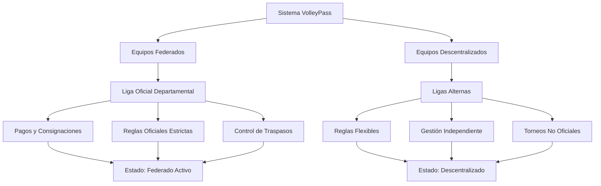
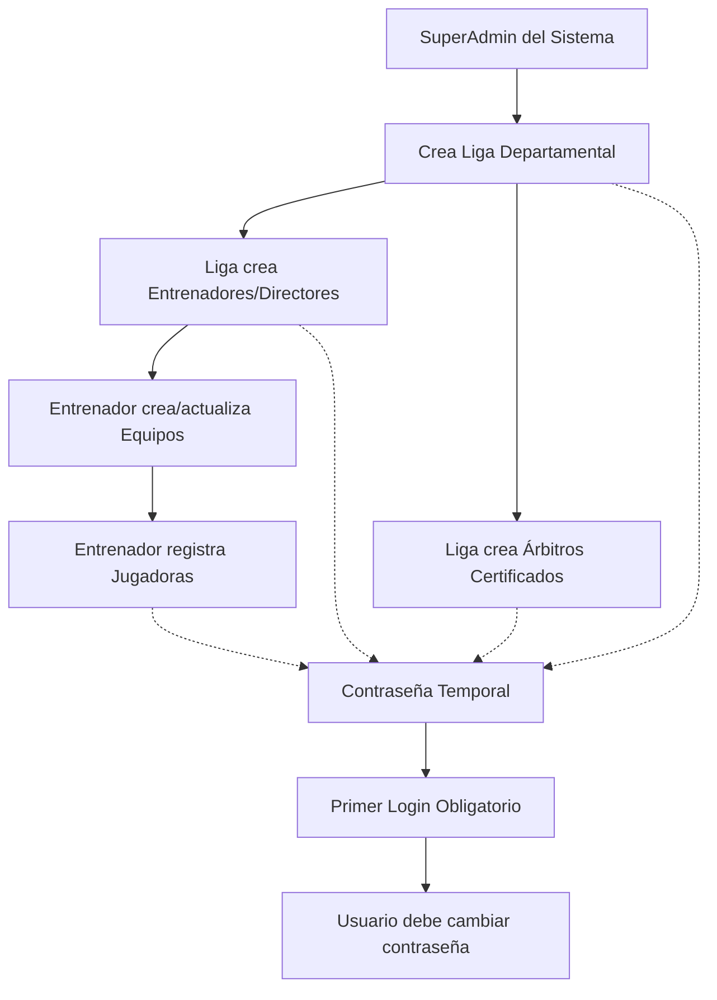
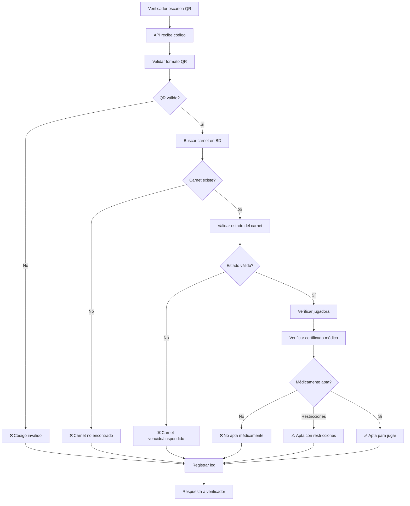
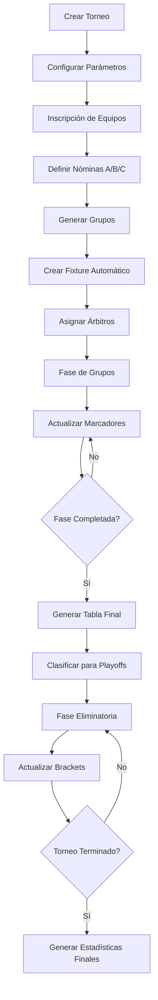

# 🏐 VolleyPass Sucre

<div align="center">


**Plataforma Integral de Gestión para Ligas de Voleibol**
*Sistema de Digitalización y Carnetización Deportiva*

[](https://laravel.com)
[](https://php.net)
[](https://livewire.laravel.com)
[](https://filamentphp.com)
[](https://mysql.com)

[🚀 Demo](#) • [📖 Documentación](#) • [🐛 Reportar Bug](#) • [💡 Solicitar Feature](#)

</div>

---

## 📋 Tabla de Contenidos

- [📖 Acerca del Proyecto](#-acerca-del-proyecto)
- [✨ Características](#-características)
- [🏗️ Arquitectura](#-arquitectura)
- [🛠️ Tecnologías](#-tecnologías)
- [⚙️ Instalación](#-instalación)
- [🚀 Inicio Rápido](#-inicio-rápido)
- [📊 Estado del Proyecto](#-estado-del-proyecto)
- [🛡️ Seguridad y Performance](#-seguridad-y-performance)
- [🚀 Comandos Especializados](#-comandos-especializados)
- [🧪 Testing](#-testing)
- [🤝 Contribuir](#-contribuir)
- [📞 Soporte](#-soporte)
- [📄 Licencia](#-licencia)

---

## 📖 Acerca del Proyecto

**VolleyPass Sucre** es una plataforma integral diseñada para digitalizar y modernizar la gestión de la Liga de Voleibol de Sucre, Colombia. El sistema centraliza el registro, verificación y gestión de jugadoras, entrenadores y clubes, tanto **federados (oficiales)** como **descentralizados (ligas alternas)**, garantizando transparencia, eficiencia y control en torneos oficiales y no oficiales.

### 🎯 Objetivo Principal

Crear un ecosistema digital completo que permita:

- ✅ **Gestión dual**: Equipos federados (liga oficial) y descentralizados (ligas alternas)
- ✅ **Sistema de federación**: Control de pagos, consignaciones y membresías
- ✅ **Reglas configurables**: Cada liga define sus propias normativas
- ✅ **Control de traspasos**: Autorización obligatoria por parte de la liga
- ✅ **Verificación instantánea** en partidos mediante códigos QR
- ✅ **Gestión completa de torneos** oficiales y alternos
- ✅ **Transparencia financiera** y deportiva

### 👥 Beneficiarios

- **Jugadoras y entrenadores** federados y de ligas alternas
- **Directivos de clubes** oficiales y descentralizados
- **Administradores de ligas** departamentales y alternativas
- **Organizadores de torneos** oficiales y no oficiales
- **Árbitros y cuerpo técnico** en eventos deportivos
- **Espectadores** con acceso a marcadores en tiempo real
- **Federaciones deportivas** y entidades reguladoras

### 🏛️ **Sistema de Federación y Ligas**

**VolleyPass** maneja dos tipos de estructuras organizacionales:



#### 🏆 **Equipos Federados (Liga Oficial)**
- **Inscripción mediante pago** validado por consignaciones
- **Reglas estrictas** definidas por la liga departamental
- **Control obligatorio** de traspasos de jugadoras
- **Participación** en torneos oficiales únicamente
- **Documentación completa** requerida
- **Auditoría constante** de cumplimiento

#### 🎯 **Equipos Descentralizados (Ligas Alternas)**
- **Inscripción libre** sin pagos obligatorios
- **Reglas flexibles** definidas por cada liga alterna
- **Gestión independiente** de jugadoras
- **Torneos no oficiales** y eventos comunitarios
- **Documentación básica** requerida
- **Autonomía** en la administración

#### 💰 **Sistema de Pagos y Federación**
```php
// Estados de federación por equipo
- pending_payment     // Equipo creado, pendiente pago
- payment_review      // Consignación en revisión
- federated_active    // Federado y activo
- federated_suspended // Federado pero suspendido por incumplimiento
- decentralized       // Equipo no federado (liga alterna)
```

#### 📋 **Reglas Configurables por Liga**
- **Traspasos**: Autorización automática vs manual por liga
- **Documentación**: Nivel de exigencia médica y legal
- **Participación**: Restricciones por categorías
- **Sanciones**: Políticas disciplinarias específicas
- **Pagos**: Esquemas de cuotas y renovaciones

### 👥 **Flujo de Creación de Usuarios**

**VolleyPass** implementa un sistema jerárquico de creación de usuarios con contraseñas temporales obligatorias:



#### 🔐 **Proceso de Registro por Actor:**

1. **SuperAdmin del Sistema**
   - Crea nuevas **Ligas Departamentales**
   - Cada liga es asignada a un **usuario administrador**
   - Genera contraseña temporal para admin de liga

2. **Administrador de Liga**
   - Crea **Entrenadores/Directores de Equipo** (usuarios)
   - Registra **Árbitros Certificados** (usuarios)
   - Aprueba documentación de jugadoras
   - Gestiona torneos de la liga

3. **Entrenador/Director de Equipo**
   - Actualiza información completa del **Equipo**
   - Registra **Jugadoras** del equipo (usuarios)
   - Define nóminas A/B/C para torneos
   - Inscribe equipos en competencias

4. **Sistema de Contraseñas Temporales**
   - **Generación automática** de contraseña al crear usuario
   - **Login forzoso** para cambio en primer acceso
   - **Notificación por email** con credenciales temporales
   - **Expiración** de contraseña temporal (7 días)

#### 📧 **Notificaciones de Registro:**

```php
// Flujo automático al crear usuario
1. Sistema genera contraseña temporal
2. Envía email con credenciales
3. Usuario debe ingresar dentro de 7 días
4. Fuerza cambio de contraseña en primer login
5. Activa cuenta después del cambio
```

---

## ✨ Características

### 🏗️ **Fase 1: Infraestructura Base** ✅ *Completada*

<details>
<summary><strong>🔐 Sistema de Usuarios Multi-Rol</strong></summary>

- **SuperAdmin**: Acceso total al sistema
- **LeagueAdmin**: Administrador de liga departamental
- **ClubDirector**: Director de club deportivo
- **Player**: Jugadora registrada
- **Coach**: Entrenador certificado
- **SportsDoctor**: Médico deportivo
- **Verifier**: Verificador de carnets en partidos
- **Referee**: Árbitro certificado para partidos oficiales

</details>

<details>
<summary><strong>🏛️ Jerarquía Organizacional</strong></summary>

```
Liga (Departamental)
└── Clubes
    ├── Jugadoras
    ├── Entrenadores
    └── Equipos por Categoría
        ├── Mini (8-10 años)
        ├── Pre-Mini (11-12 años)
        ├── Infantil (13-14 años)
        ├── Cadete (15-16 años)
        ├── Juvenil (17-18 años)
        ├── Mayores (19+ años)
        └── Masters (35+ años)
```

</details>

<details>
<summary><strong>🌍 Ubicaciones Geográficas</strong></summary>

- **Colombia completa**: 32 departamentos, 1,100+ municipios
- **Integración nativa** con códigos DANE
- **Búsquedas inteligentes** por ubicación

</details>

### 🚀 **Fase 2: Carnetización Digital** ✅ *Completada*

<details>
<summary><strong>📄 Gestión Completa de Documentos</strong></summary>

- **Tipos soportados**: Cédula, certificados médicos, fotografías, autorizaciones
- **Validación automática**: Formatos, tamaños y vencimientos
- **Estados dinámicos**: Pendiente, aprobado, rechazado, vencido
- **Versionado**: Historial completo de cambios por documento

</details>

<details>
<summary><strong>🆔 Sistema de Carnets Digitales</strong></summary>

- **Generación automática** tras aprobación de documentos
- **QR únicos** con hash SHA-256 y tokens de verificación
- **Estados avanzados**: Activo, vencido, suspendido, restricción médica
- **Renovación automática** por temporadas
- **Historial completo** de cambios y verificaciones

</details>

<details>
<summary><strong>📱 API de Verificación en Tiempo Real</strong></summary>

- **Endpoint REST** optimizado para aplicaciones móviles
- **Verificación instantánea** con resultados en milisegundos
- **Estados de respuesta**:
  - ✅ **Apta**: Verde (documentación al día)
  - ⚠️ **Restricción**: Amarillo (limitaciones específicas)
  - ❌ **No Apta**: Rojo (documentación vencida o suspensión)
- **Verificación por lotes** para eventos grandes
- **Geo-localización** y logging detallado

</details>

<details>
<summary><strong>🏥 Módulo Médico Avanzado</strong></summary>

- **Certificados médicos** con validación profesional
- **Estados médicos**: Apta, Restricción parcial, No apta, En tratamiento, Recuperación
- **Alertas automáticas** de vencimiento (30, 15, 7, 3, 1 días)
- **Restricciones específicas** por posición y tipo de evento
- **Historial médico** completo con seguimiento de lesiones

</details>

<details>
<summary><strong>🔔 Sistema de Notificaciones</strong></summary>

- **Múltiples canales**: Email, base de datos, push (preparado)
- **Notificaciones inteligentes**: Vencimientos, aprobaciones, recordatorios
- **Batching automático** para evitar spam
- **Rate limiting** personalizable por usuario
- **Templates responsive** para todos los dispositivos

</details>

### 🏆 **Fase 3: Gestión Avanzada** ⏳ *Pendiente*

<details>
<summary><strong>📊 Estadísticas Deportivas Avanzadas</strong></summary>

- **Rankings individuales** por posición y categoría
- **Estadísticas de rendimiento** por jugadora/equipo
- **Análisis de performance** histórico
- **Métricas de participación** en torneos
- **Reportes personalizables** para entrenadores

</details>

<details>
<summary><strong>🏅 Sistema de Reconocimientos</strong></summary>

- **MVP** de partidos y torneos
- **Selecciones** departamentales y nacionales
- **Premios especiales** y reconocimientos
- **Historial de logros** por jugadora
- **Certificados digitales** de participación

</details>

<details>
<summary><strong>💰 Gestión de Pagos y Finanzas</strong></summary>

- **Inscripciones** a torneos y eventos
- **Cuotas** de afiliación de clubes
- **Facturación automática** y reportes
- **Integración** con pasarelas de pago
- **Control financiero** completo

</details>

### 🏆 **Fase 4: Sistema de Gestión de Torneos** ⏳ *Pendiente*

<details>
<summary><strong>🏟️ Tipos de Torneos</strong></summary>

- **Liga Regular**: Todos contra todos
- **Copa/Eliminación**: Fase eliminatoria directa
- **Mixto**: Fase de grupos + eliminatorias
- **Round Robin**: Grupos con todos contra todos
- **Torneos Relámpago**: Formato corto intensivo
- **Torneos Inter-Ligas**: Competencias departamentales/nacionales

</details>

<details>
<summary><strong>⚙️ Configuración Automática de Partidos</strong></summary>

- **Generación automática** de fixtures según equipos inscritos
- **Algoritmo inteligente** para distribución equitativa
- **Manejo de números impares** de equipos con byes automáticos
- **Calendario optimizado** considerando disponibilidad de canchas
- **Reprogramación inteligente** por eventos climáticos o emergencias

</details>

<details>
<summary><strong>👥 Gestión de Nóminas por Equipo</strong></summary>

- **Nómina A, B, C** según cantidad de jugadoras disponibles
- **Decisión por entrenador** al momento de inscripción
- **Verificación automática** de elegibilidad por categoría
- **Rotación de nóminas** entre partidos del mismo torneo
- **Control de límites** de jugadoras por categoría y torneo

</details>

<details>
<summary><strong>🗂️ Distribución Inteligente de Grupos</strong></summary>

- **Algoritmo de balanceo** para grupos equitativos
- **Consideración de rankings** históricos de equipos
- **Separación geográfica** para reducir costos de desplazamiento
- **Evitar enfrentamientos** prematuros entre equipos fuertes
- **Redistribución automática** si hay retiros de último momento

</details>

<details>
<summary><strong>📊 Configuración por Tipo de Torneo</strong></summary>

```php
// Configuraciones específicas por tipo
- Sets por partido (3 de 5, 2 de 3, etc.)
- Puntos por set (25, 21, 15)
- Tiempo límite por set
- Reglas de desempate
- Puntos de tabla (3-1-0, 3-2-1-0)
- Clasificación automática
- Criterios de ranking
```

</details>

<details>
<summary><strong>🔄 Transición Fase de Grupos → Fase de Llaves</strong></summary>

- **Clasificación automática** según puntos de tabla
- **Criterios de desempate** configurables
- **Generación automática** de brackets eliminatorios
- **Siembra** de equipos según ranking final de grupos
- **Cruces estratégicos** para evitar repetición de enfrentamientos

</details>

<details>
<summary><strong>🏆 Sistema de Puntuación y Estadísticas</strong></summary>

- **Marcador en tiempo real** durante partidos
- **Puntos por partido** con sistema configurable
- **Acumulación automática** en tabla de posiciones
- **Estadísticas individuales** por jugadora
- **Métricas avanzadas**: Eficiencia, aces, bloqueos, recepciones

</details>

<details>
<summary><strong>🎮 Gestor de Partidos en Vivo</strong></summary>

- **Lista de jugadoras** verificadas para cada partido
- **Formaciones iniciales** y cambios en tiempo real
- **Marcador digital** con sets y puntos
- **Historial completo** de puntos por set
- **Timeline** de eventos importantes del partido

</details>

<details>
<summary><strong>🔄 Sistema de Rotaciones</strong></summary>

- **Tracking automático** de rotaciones por punto
- **Posiciones en cancha** actualizadas en tiempo real
- **Cambios de jugadoras** con registro temporal
- **Validación de rotaciones** según reglas oficiales
- **Alertas** por infracciones de rotación

</details>

<details>
<summary><strong>🟨 Gestión de Amonestaciones</strong></summary>

- **Tarjetas amarillas/rojas** con registro automático
- **Razones predefinidas** (conducta, retraso, etc.)
- **Acumulación por torneo** y consecuencias
- **Suspensiones automáticas** por acumulación
- **Reportes disciplinarios** para la liga

</details>

<details>
<summary><strong>👨‍⚖️ Asignación de Árbitros</strong></summary>

- **Base de datos** de árbitros certificados
- **Asignación automática** considerando disponibilidad
- **Evitar conflictos** de interés con equipos
- **Distribución equitativa** de partidos por árbitro
- **Evaluación post-partido** por equipos participantes

</details>

<details>
<summary><strong>📚 Historial Completo de Partidos</strong></summary>

- **Archivo histórico** de todos los enfrentamientos
- **Estadísticas comparativas** entre equipos
- **Rendimiento histórico** de jugadoras
- **Tendencias** y análisis de rendimiento
- **Exportación** de datos para análisis externos

</details>

<details>
<summary><strong>📡 API para Marcadores en Tiempo Real</strong></summary>

```php
// Endpoints especializados
GET /api/tournaments/{id}/live        // Estado general del torneo
GET /api/matches/{id}/live           // Marcador en tiempo real
POST /api/matches/{id}/score         // Actualizar puntuación
GET /api/tournaments/{id}/standings  // Tabla de posiciones
WebSocket /live-scores               // Actualizaciones instantáneas
```

</details>

<details>
<summary><strong>📺 Vista Pública de Marcadores</strong></summary>

- **Dashboard público** sin autenticación requerida
- **Marcadores en tiempo real** de todos los partidos activos
- **Tabla de posiciones** actualizada automáticamente
- **Próximos partidos** con horarios y canchas
- **Resultados históricos** del torneo
- **QR codes** para acceso rápido desde dispositivos móviles

</details>

### 🏗️ **Fase 5: Interfaces de Usuario** ⏳ *Pendiente - CRÍTICO*

<details>
<summary><strong>💻 Panel Administrativo (Filament) - URGENTE</strong></summary>

**Estado Actual**: Solo User Resource implementado

**Pendientes Críticos**:
- **PlayerResource** - Gestión completa de jugadoras
- **ClubResource** - Administración de clubes 
- **LeagueResource** - Gestión de ligas
- **TournamentResource** - Administración de torneos
- **MatchResource** - Gestión de partidos
- **RefereeResource** - Administración de árbitros
- **TeamResource** - Gestión de equipos
- **MedicalCertificateResource** - Certificados médicos
- **PlayerCardResource** - Gestión de carnets

**Dashboard Requerido**:
- Métricas en tiempo real
- Widgets de estadísticas
- Alertas de vencimientos
- Resumen de torneos activos

</details>

<details>
<summary><strong>📱 App Móvil para Verificadores</strong></summary>

- **Scanner QR** optimizado para verificación rápida
- **Modo offline** para zonas sin conectividad
- **Sincronización automática** cuando hay conexión
- **Interfaz intuitiva** para uso en campo

</details>

<details>
<summary><strong>🌐 Dashboard Público para Torneos</strong></summary>

- **Marcadores en tiempo real** sin autenticación
- **Tabla de posiciones** actualizada automáticamente
- **Calendario de partidos** con horarios
- **Estadísticas públicas** de equipos y jugadoras

</details>

<details>
<summary><strong>👨‍💼 Interfaces por Rol de Usuario</strong></summary>

**SuperAdmin**:
- Gestión completa del sistema
- Creación de ligas
- Reportes globales

**Liga Admin**:
- Gestión de equipos y entrenadores
- Aprobación de documentos
- Administración de torneos

**Entrenador/Director**:
- Gestión del equipo
- Registro de jugadoras
- Inscripción a torneos

**Jugadora**:
- Perfil personal
- Estado de carnet
- Historial deportivo

**Árbitro**:
- Partidos asignados
- Interface de marcador
- Reportes de partido

</details>

---

## 🏗️ Arquitectura

### 🗂️ Estructura del Proyecto

```
volleypass/
├── 📁 app/
│   ├── 📁 Console/Commands/    # Comandos personalizados
│   ├── 📁 Enums/              # Estados y tipos de datos (25+ enums)
│   ├── 📁 Http/
│   │   ├── 📁 Controllers/    # Controladores principales + API
│   │   └── 📁 Requests/       # Form requests con validación
│   ├── 📁 Jobs/               # Jobs para colas (notificaciones, reportes)
│   ├── 📁 Models/             # Modelos Eloquent (30+ modelos)
│   │   ├── User.php           # Usuario con roles y perfiles
│   │   ├── Player.php         # Jugadora con estadísticas
│   │   ├── PlayerCard.php     # Carnets digitales con QR
│   │   ├── MedicalCertificate.php # Certificados médicos
│   │   ├── QrScanLog.php      # Logs de verificación
│   │   ├── Tournament.php     # Gestión de torneos
│   │   ├── Match.php          # Partidos individuales
│   │   ├── MatchScore.php     # Marcadores por set
│   │   └── ...
│   ├── 📁 Notifications/      # Sistema de notificaciones
│   ├── 📁 Services/           # Servicios de negocio
│   │   ├── QrVerificationService.php # Lógica de verificación
│   │   ├── TournamentService.php     # Gestión de torneos
│   │   ├── MatchService.php          # Lógica de partidos
│   │   └── NotificationBatchingService.php
│   ├── 📁 Traits/             # Funcionalidades reutilizables (8 traits)
│   └── 📁 Providers/          # Service providers
├── 📁 config/                 # Configuraciones especializadas
├── 📁 database/
│   ├── 📁 migrations/         # 45+ migraciones funcionales
│   ├── 📁 seeders/            # Datos completos de Colombia
│   └── 📁 factories/          # Factories para testing
├── 📁 resources/
│   ├── 📁 views/              # Vistas Blade + Livewire + Flux
│   │   ├── 📁 emails/         # Templates de notificaciones
│   │   ├── 📁 livewire/       # Componentes reactivos
│   │   └── 📁 tournaments/    # Vistas públicas de torneos
│   └── 📁 js/                 # Frontend assets + WebSockets
└── 📁 routes/                 # Rutas web + API + console
```

### 🔄 Flujo de Verificación de Carnets



### 🏆 Flujo de Gestión de Torneos



---

## 🛠️ Tecnologías

### 🚀 Core Framework

- **[Laravel 12.x](https://laravel.com)** - Framework PHP moderno
- **[Livewire 3.x](https://livewire.laravel.com)** - Componentes reactivos
- **[Volt](https://livewire.laravel.com/docs/volt)** - Sintaxis simplificada

### 📦 Paquetes Principales

- **[Spatie Permission](https://spatie.be/docs/laravel-permission)** - Sistema completo de roles y permisos
- **[Spatie Media Library](https://spatie.be/docs/laravel-medialibrary)** - Gestión avanzada de archivos multimedia
- **[Spatie Activity Log](https://spatie.be/docs/laravel-activitylog)** - Auditoría completa del sistema
- **[Spatie Backup](https://spatie.be/docs/laravel-backup)** - Respaldos automáticos programados
- **[Simple QR Code](https://www.simplesoftwareio.com/simple-qrcode)** - Generación de códigos QR seguros
- **[Intervention Image](http://image.intervention.io)** - Procesamiento y optimización de imágenes
- **[Maatwebsite Excel](https://laravel-excel.com)** - Exportación de reportes y estadísticas

### 🎨 Frontend

- **[Livewire Flux](https://fluxui.dev)** - Componentes UI modernos y accesibles
- **[Tailwind CSS](https://tailwindcss.com)** - Framework CSS utility-first
- **[Alpine.js](https://alpinejs.dev)** - JavaScript reactivo ligero
- **[WebSockets](https://pusher.com)** - Actualizaciones en tiempo real (preparado)

### 🗃️ Base de Datos

- **[MySQL 8.0+](https://mysql.com)** - Base de datos relacional principal
- **45+ tablas** con relaciones complejas optimizadas
- **Índices estratégicos** para consultas de alta performance
- **Soft deletes** y auditoría en modelos críticos

### ☁️ Servicios Externos (Preparados)

- **[FCM](https://firebase.google.com/docs/cloud-messaging)** - Push notifications
- **[Twilio](https://www.twilio.com)** - SMS notifications
- **[AWS S3](https://aws.amazon.com/s3)** - Almacenamiento en la nube
- **[Pusher](https://pusher.com)** - WebSockets para marcadores en tiempo real

### 🛠️ Desarrollo

- **[Laravel Telescope](https://laravel.com/docs/telescope)** - Debugging
- **[Laravel Debugbar](https://github.com/barryvdh/laravel-debugbar)** - Debug bar
- **[PHPStan](https://phpstan.org)** - Análisis estático *(planeado)*

---

## ⚙️ Instalación

### 📋 Prerequisitos

```bash
# Verificar versiones requeridas
php --version    # PHP 8.2+
composer --version # Composer 2.x
mysql --version    # MySQL 8.0+
node --version     # Node.js 18+ (opcional)
```

### 🚀 Instalación Completa

#### 1️⃣ Clonar el Repositorio

```bash
git clone https://github.com/korozcolt/volleypass-new.git
cd volleypass-new
```

#### 2️⃣ Instalar Dependencias

```bash
# Dependencias PHP
composer install

# Dependencias Node.js (opcional)
npm install && npm run build
```

#### 3️⃣ Configurar Entorno

```bash
# Copiar archivo de configuración
cp .env.example .env

# Generar clave de aplicación
php artisan key:generate

# Crear enlace de almacenamiento
php artisan storage:link
```

#### 4️⃣ Configurar Base de Datos

```bash
# Editar .env con tus credenciales de BD
DB_CONNECTION=mysql
DB_HOST=127.0.0.1
DB_PORT=3306
DB_DATABASE=volleypass
DB_USERNAME=tu_usuario
DB_PASSWORD=tu_password
```

#### 5️⃣ Ejecutar Migraciones y Seeders

```bash
# Crear todas las tablas y datos iniciales
php artisan migrate:fresh --seed
```

#### 6️⃣ Configurar Permisos

```bash
# Permisos de almacenamiento
chmod -R 755 storage bootstrap/cache
```

---

## 🚀 Inicio Rápido

### 🖥️ Servidor de Desarrollo

```bash
# Iniciar servidor
php artisan serve

# Acceder a la aplicación
# http://localhost:8000
```

### 👤 Usuarios de Prueba

El seeder crea automáticamente usuarios de ejemplo:

| Email | Contraseña | Rol |
|-------|------------|-----|
| `admin@volleypass.com` | `password` | SuperAdmin |
| `liga@volleypass.com` | `password` | LeagueAdmin |
| `club@volleypass.com` | `password` | ClubDirector |

### 🧪 Verificar Instalación

```bash
# Ejecutar tests (cuando estén implementados)
php artisan test

# Verificar configuración del sistema
php artisan config:show

# Comprobar rutas disponibles
php artisan route:list

# Verificar jobs en cola
php artisan queue:work

# Probar notificaciones
php artisan volleypass:test-notifications 1

# Generar carnets de prueba
php artisan volleypass:generate-season-cards 2025
```

### 📊 Filament Admin Panel

```bash
# Acceder al panel administrativo
# http://localhost:8000/admin

# Actualmente solo User Resource implementado
# Pendientes: Player, Club, Tournament, etc.
```

### 📊 Telescope (Debugging)

```bash
# Acceder a Telescope
# http://localhost:8000/telescope
```

---

## 📊 Estado del Proyecto

### ✅ **Fase 1 - Infraestructura Base** (Completada)

| Componente | Estado | Progreso |
|------------|--------|----------|
| 🔐 Sistema de Autenticación | ✅ Completado | 100% |
| 👥 Gestión de Roles (7 roles) | ✅ Completado | 100% |
| 🏛️ Estructura Organizacional | ✅ Completado | 100% |
| 🌍 Ubicaciones Geográficas | ✅ Completado | 100% |
| 📦 Integración Spatie (8 paquetes) | ✅ Completado | 100% |
| 📝 Sistema de Logging | ✅ Completado | 100% |

### ✅ **Fase 2 - Carnetización Digital** (Completada)

| Componente | Estado | Progreso |
|------------|--------|----------|
| 📄 Gestión de Documentos | ✅ Completado | 100% |
| 🆔 Carnets Digitales con QR | ✅ Completado | 100% |
| 🔍 API de Verificación | ✅ Completado | 100% |
| 🏥 Módulo Médico Avanzado | ✅ Completado | 100% |
| 🔔 Sistema de Notificaciones | ✅ Completado | 100% |
| ⚙️ Jobs y Comandos Automáticos | ✅ Completado | 100% |
| 📊 Logging y Auditoría Completa | ✅ Completado | 100% |

### 🚧 **Fase 3 - Gestión Avanzada** (Incluido en MVP)

| Componente | Estado | Progreso | MVP |
|------------|--------|----------|-----|
| 💰 Sistema de Pagos y Federación | ⏳ Pendiente | 0% | ✅ Sí |
| ⚖️ Reglas Configurables por Liga | ⏳ Pendiente | 0% | ✅ Sí |
| 🔄 Gestión de Traspasos | ⏳ Pendiente | 0% | ✅ Sí |
| 🏛️ Federados vs Descentralizados | ⏳ Pendiente | 0% | ✅ Sí |
| 📊 Estadísticas Deportivas | ⏳ Pendiente | 0% | ❌ Post-MVP |
| 🏅 Sistema de Premios | ⏳ Pendiente | 0% | ❌ Post-MVP |

### 🏆 **Fase 4 - Sistema de Gestión de Torneos** (Incluido en MVP)

| Componente | Estado | Progreso | MVP |
|------------|--------|----------|-----|
| 🏟️ Tipos de Torneos | ⏳ Pendiente | 0% | ✅ Sí |
| ⚙️ Configuración Automática de Partidos | ⏳ Pendiente | 0% | ✅ Sí |
| 👥 Gestión de Nóminas A/B/C | ⏳ Pendiente | 0% | ✅ Sí |
| 🗂️ Distribución de Grupos | ⏳ Pendiente | 0% | ✅ Sí |
| 🔄 Transición Grupos → Llaves | ⏳ Pendiente | 0% | ✅ Sí |
| 🏆 Sistema de Puntuación | ⏳ Pendiente | 0% | ✅ Sí |
| 🎮 Gestor de Partidos en Vivo | ⏳ Pendiente | 0% | ✅ Sí |
| 🔄 Sistema de Rotaciones | ⏳ Pendiente | 0% | ✅ Sí |
| 🟨 Gestión de Amonestaciones | ⏳ Pendiente | 0% | ✅ Sí |
| 👨‍⚖️ Asignación de Árbitros | ⏳ Pendiente | 0% | ✅ Sí |
| 📚 Historial de Partidos | ⏳ Pendiente | 0% | ✅ Sí |
| 📡 API Tiempo Real | ⏳ Pendiente | 0% | ✅ Sí |
| 📺 Vista Pública de Marcadores | ⏳ Pendiente | 0% | ✅ Sí |

### ✅ **Fase 5 - Panel Administrativo Completo** (Completada)

| Componente | Estado | Progreso | Prioridad |
|------------|--------|----------|-----------|
| 💻 **Sistema de Configuraciones** | ✅ Completado | 100% | 🔴 Alta |
| 💻 UserResource (Filament) | ✅ Completado | 100% | 🔴 Alta |
| 💻 PlayerResource (Filament) | ✅ Completado | 100% | 🔴 Alta |
| 💻 ClubResource (Filament) | ✅ Completado | 100% | 🔴 Alta |
| 💻 LeagueResource (Filament) | ✅ Completado | 100% | 🔴 Alta |
| 💻 TeamResource (Filament) | ✅ Completado | 100% | � Alta |
| 💻 TournamentResource (Filament) | ✅ Completado | 100% | 🔴 Alta |
| 💻 PlayerCardResource (Filament) | ✅ Completado | 100% | 🔴 Alta |
| 💻 MedicalCertificateResource | ✅ Completado | 100% | 🔴 Alta |
| 💻 PaymentResource (Filament) | ✅ Completado | 100% | 🔴 Alta |
| 💻 RoleResource (Filament) | ✅ Completado | 100% | �  Media |
| 💻 NotificationResource (Filament) | ✅ Completado | 100% | 🟡 Media |
| 💻 SystemConfigurationResource | ✅ Completado | 100% | 🔴 Alta |
| � Das hboard Principal | ✅ Completado | 100% | � Alta ||
| 💻 Widgets y Estadísticas | ✅ Completado | 100% | 🔴 Alta |
| 🌐 Header Personalizado | ✅ Completado | 100% | � Med|ia |
| 🔧 Modo Mantenimiento | ✅ Completado | 100% | 🟡 Media |
| 📱 App Móvil Verificadores | ⏳ Pendiente | 0% | 🟡 Media |
| 🌐 Dashboard Público Torneos | ⏳ Pendiente | 0% | 🔴 Alta |
| 👨‍💼 Interfaces por Rol | ⏳ Pendiente | 0% | 🔴 Alta |

### 🎯 **Sistema de Configuraciones Dinámicas** ✅ *Completado*

<details>
<summary><strong>⚙️ Configuraciones que Impactan el Sistema</strong></summary>

**Aplicación**:
- `app.name` → Nombre dinámico en header, dashboard, emails
- `app.description` → Descripción en vistas y notificaciones
- `app.version` → Versión mostrada en todo el sistema

**Federación**:
- `federation.annual_fee` → Cuota usada en cálculos de pagos
- `federation.card_validity_months` → Validez de carnets en meses
- `federation.auto_approve_payments` → Aprobación automática de pagos

**Seguridad**:
- `security.max_login_attempts` → Límite de intentos de login
- `security.session_timeout` → Tiempo de sesión en minutos

**Archivos**:
- `files.max_upload_size` → Tamaño máximo en MB (aplica a PHP)
- `files.allowed_extensions` → Extensiones permitidas

**Notificaciones**:
- `notifications.email_enabled` → Habilita/deshabilita emails
- `notifications.admin_email` → Email del administrador
- `notifications.whatsapp_enabled` → Habilita WhatsApp

**Mantenimiento**:
- `maintenance.mode` → Activa/desactiva modo mantenimiento
- `maintenance.message` → Mensaje personalizado

</details>

<details>
<summary><strong>🛠️ Herramientas de Gestión</strong></summary>

**Comandos de Consola**:
```bash
# Obtener configuración
php artisan system:config get app.name

# Establecer configuración
php artisan system:config set app.name "Mi Sistema"

# Listar todas las configuraciones
php artisan system:config list

# Listar por grupo
php artisan system:config list --group=federation

# Recargar configuraciones
php artisan system:config reload

# Resetear a valores por defecto
php artisan system:config reset --force

# Probar configuraciones
php artisan system:config test
```

**Funciones Helper Globales**:
```php
app_name()           // Nombre dinámico
app_description()    // Descripción dinámica
app_version()        // Versión configurable
federation_fee()     // Cuota de federación
is_maintenance_mode() // Estado de mantenimiento
system_config()      // Acceso directo a configuraciones
```

**Panel Administrativo**:
- ✅ Interfaz completa para gestionar configuraciones
- ✅ Validación por tipos (string, number, boolean, json, date)
- ✅ Configuraciones públicas/privadas
- ✅ Agrupación por categorías
- ✅ Botones de prueba para configuraciones críticas
- ✅ Recarga automática después de cambios

</details>

<details>
<summary><strong>🎨 Header Personalizado del Panel</strong></summary>

**Características**:
- ✅ Logo optimizado para 320x64px (rectangular)
- ✅ Nombre de la aplicación dinámico desde configuraciones
- ✅ Descripción configurable
- ✅ Versión del sistema visible
- ✅ Diseño responsive
- ✅ Actualización automática al cambiar configuraciones

**Implementación**:
```html
<div class="flex items-center space-x-3">
    
    <div class="flex flex-col">
        <span class="text-lg font-semibold">{{ app_name() }}</span>
        <span class="text-xs text-gray-500">{{ app_description() }}</span>
    </div>
</div>
```

</details>

<details>
<summary><strong>🔧 Modo Mantenimiento Inteligente</strong></summary>

**Características**:
- ✅ Activación desde panel administrativo
- ✅ Mensaje personalizable
- ✅ Página elegante con logo y información
- ✅ Auto-refresh cada 30 segundos
- ✅ Contador de tiempo transcurrido
- ✅ Acceso para super administradores
- ✅ Middleware inteligente que detecta rutas admin

**Vista de Mantenimiento**:
- ✅ Diseño moderno con gradientes
- ✅ Logo del sistema
- ✅ Información de estado
- ✅ Tiempo estimado de finalización
- ✅ Enlace directo al panel admin

</details>

### 📅 **Roadmap Actualizado**

- **✅ Q4 2024**: Fase 1 completada (Infraestructura base)
- **✅ Q1 2025**: Fase 2 completada (Carnetización digital)
- **🚧 Q2 2025**: **MVP COMPLETO** - Fases 3, 4 y 5 (Sistema completo sin app móvil)
- **📱 Q3 2025**: App Móvil nativa y estadísticas avanzadas
- **🌐 Q4 2025**: Optimizaciones y features avanzadas
- **🌐 2026**: Integración con otras ligas departamentales

---

## 🛡️ Seguridad y Performance

### 🔒 **Medidas de Seguridad Implementadas**

- **Hash SHA-256** para códigos QR únicos
- **Tokens de verificación** adicionales
- **Rate limiting** en API de verificación
- **Validación estricta** de documentos
- **Auditoría completa** de todas las acciones
- **Soft deletes** para recuperación de datos

### ⚡ **Optimizaciones de Performance**

- **Cache inteligente** para consultas frecuentes
- **Índices estratégicos** en base de datos
- **Jobs en cola** para operaciones pesadas
- **Batch processing** para notificaciones masivas
- **API optimizada** con respuestas < 100ms
- **Lazy loading** para relaciones complejas

### 📈 **Monitoreo y Mantenimiento**

#### 📊 **Herramientas de Monitoreo**

```bash
# Telescope para debugging en desarrollo
http://localhost:8000/telescope

# Logs detallados por categoría
storage/logs/laravel.log

# Métricas de verificaciones QR
php artisan volleypass:generate-report daily

# Estado de jobs en cola
php artisan queue:monitor
```

#### 🔧 **Mantenimiento Automático**

- **Limpieza de logs** antiguos programada
- **Respaldos automáticos** de base de datos
- **Notificaciones** de vencimientos
- **Reportes estadísticos** programados
- **Validación** de integridad de datos

---

## 🚀 Comandos Especializados

VolleyPass incluye comandos personalizados para gestión automatizada:

```bash
# Enviar notificaciones de vencimiento
php artisan volleypass:send-expiry-notifications --days=30

# Generar carnets para nueva temporada
php artisan volleypass:generate-season-cards 2025

# Limpiar logs antiguos del sistema
php artisan volleypass:cleanup-logs --qr-days=365

# Generar reportes estadísticos
php artisan volleypass:generate-report weekly --email=admin@liga.com

# Probar sistema de notificaciones
php artisan volleypass:test-notifications 1
```

### ⚡ Tareas Programadas

El sistema ejecuta automáticamente:

- **Diario 08:00**: Notificaciones de vencimiento de carnets
- **Diario 06:00**: Verificación de certificados médicos vencidos
- **Lunes 09:00**: Reporte semanal de estadísticas
- **Mensual**: Limpieza de logs antiguos y reportes mensuales

---

## 🧪 Testing

```bash
# Ejecutar todos los tests (cuando estén implementados)
php artisan test

# Tests con cobertura
php artisan test --coverage

# Verificar integridad del sistema
php artisan volleypass:test-notifications 1
```

---

## 🤝 Contribuir

¡Las contribuciones son bienvenidas! Este proyecto sigue las mejores prácticas de desarrollo.

### 📝 Guías de Contribución

1. **Fork** el proyecto
2. **Crea** una rama para tu feature (`git checkout -b feature/AmazingFeature`)
3. **Commit** tus cambios (`git commit -m 'Add some AmazingFeature'`)
4. **Push** a la rama (`git push origin feature/AmazingFeature`)
5. **Abre** un Pull Request

### 📋 Estándares de Código

- **PSR-12** para estilo de código PHP
- **Laravel conventions** para nombres y estructura
- **Eloquent** preferido sobre Query Builder
- **Comentarios en español** para lógica de negocio
- **Enums** para todos los estados y tipos
- **Traits** para funcionalidades reutilizables
- **Services** para lógica de negocio compleja
- **Jobs** para procesamiento asíncrono

### 🏐 **Características Implementadas**

**Sistema Completo de Carnetización Digital:**

- ✅ Generación automática de carnets con QR únicos
- ✅ API REST optimizada para verificación en tiempo real
- ✅ Estados médicos avanzados con restricciones específicas
- ✅ Notificaciones inteligentes multi-canal
- ✅ Gestión completa de documentos con versionado
- ✅ Logging detallado para auditoría y debugging
- ✅ 45+ migraciones con datos reales de Colombia
- ✅ 25+ enums para estados y validaciones
- ✅ 8 traits reutilizables para funcionalidades comunes
- ✅ Comandos automáticos para mantenimiento del sistema

**Flujo Operativo Completo:**

1. Director de club carga documentos de jugadora
2. Liga admin revisa y aprueba documentación
3. Sistema genera carnet digital automáticamente
4. Verificador escanea QR en eventos deportivos
5. API valida instantáneamente y retorna estado
6. Sistema registra toda la actividad para auditoría

---

## 📞 Soporte y Contacto

### 🏐 **Liga de Voleibol de Sucre**

- 📧 **Email**: <liga@volleypass.sucre.gov.co>
- 📱 **WhatsApp**: +57 (5) 282-5555
- 🏢 **Dirección**: Cra. 25 #16-50, Sincelejo, Sucre
- 🌐 **Website**: [volleypass.sucre.gov.co](#)

### 💻 **Soporte Técnico**

- 📧 **Email**: <soporte@volleypass.sucre.gov.co>
- 📋 **Issues**: [GitHub Issues](https://github.com/korozcolt/volleypass-new/issues)
- 📖 **Documentación**: [docs.volleypass.sucre.gov.co](#)
- 🚨 **Emergencias**: +57 300 123 4567 (24/7)

### 🎓 **Capacitación y Recursos**

- 📹 **Tutoriales**: Canal YouTube VolleyPass
- 📚 **Manuales**: Biblioteca digital de recursos
- 🎯 **Webinars**: Capacitaciones mensuales para usuarios
- 💬 **Comunidad**: Grupo WhatsApp de soporte

---

## 📄 Licencia

Este proyecto está licenciado bajo la **Licencia MIT**. Ver [LICENSE](LICENSE) para más detalles.

### 🤝 Uso Permitido

- ✅ Uso comercial y no comercial
- ✅ Modificación y distribución
- ✅ Uso privado y público
- ✅ Inclusión en otros proyectos

### ⚠️ Limitaciones

- ❌ Sin garantía de funcionamiento
- ❌ Los autores no asumen responsabilidad
- ❌ Marca "VolleyPass" es propiedad del desarrollador

---

## 🙏 Agradecimientos Especiales

### 👨‍💻 **Comunidad Técnica**

- **Comunidad Laravel Colombia** - Por el apoyo y feedback
- **Spatie Team** - Por los excelentes paquetes open source
- **Filament PHP** - Por los componentes UI modernos
- **Livewire Team** - Por la reactividad sin complicaciones

### 🏐 **Comunidad Deportiva**

- **Clubes participantes** - Por las pruebas y retroalimentación
- **Jugadoras voluntarias** - Por participar en el piloto
- **Entrenadores** - Por adoptar la nueva tecnología
- **Verificadores** - Por validar el sistema en campo

---

<div align="center">

**🏐 Desarrollado con ❤️ para el voleibol sucreño**

*"Digitalizando el deporte, fortaleciendo la comunidad"*

### 🌟 **Stats del Proyecto**


### 📊 **Métricas de Desarrollo**


[⬆️ Volver arriba](#-volleypass-sucre)

</div>
